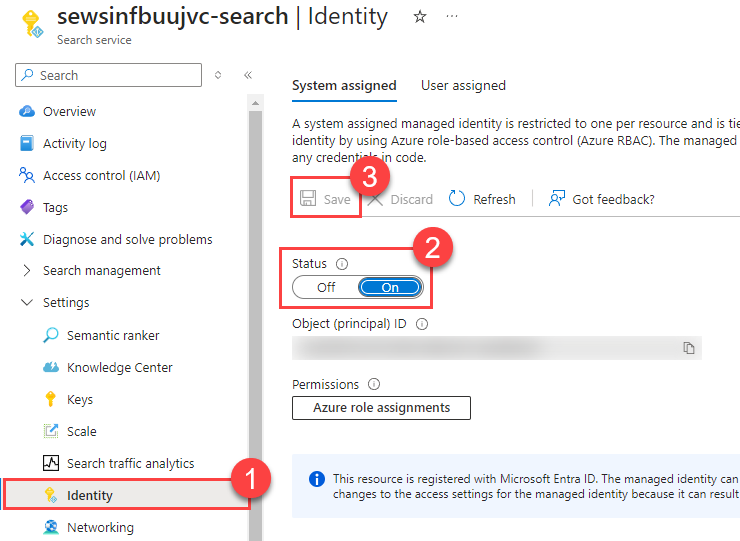
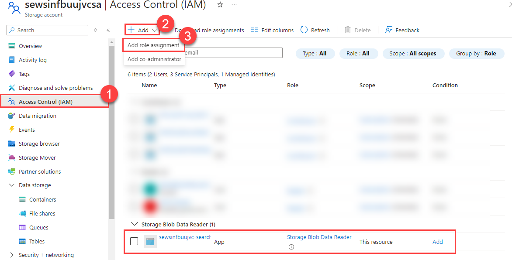

# Task 02 - Query data from Azure AI Search (20 minutes)

## Introduction

The ChatGPT series of models available in Azure OpenAI has been trained on a wide variety of datasets online, but these datasets tend to be publicly available. For private and proprietary datasets, we will need a different approach than to expect ChatGPT has the available information. In this second task of the exercise, we will push data into an Azure storage account and convert it into an Azure AI Search index.

## Description

In this task, you will load data that Contoso Suites staff has provided to you into Azure Blob Storage. This data contains a summary, in JSON format, of several of their resort properties and hotels located on the resorts. This is an example of the type of data the company would like to use to enhance chat results, so they would like you to incorporate this data into the Azure OpenAI proof of concept. You may find these files in [the src/data folder](https://github.com/microsoft/TechExcel-Integrating-Azure-PaaS-and-AI-Services-for-AI-Design-Wins/tree/main/src/data) for the repository.

The key tasks are as follows:

1. Import the data from **Resorts.txt** into a container named `contoso-suites`.
2. Import the data from **Hotels.txt** into a container named `contoso-suites`.
3. Import the data from **FAQ.txt** into a container named `contoso-suites`.
4. Create a `contoso-suites-faq` index in Azure AI Search, built on the three files in the `contoso-suites` container in your storage account. You should embed with `text-embedding-002-ada` and support Hybrid (Vector + Keyword) search.
5. Update the front-end code in `src/ContosoSuitesDashboard/` to enable chat operations against the FAQ index.
   1. Create a file called `secrets.toml` in `src/ContosoSuitesDashboard/.streamlit/`. Pattern it after `secrets.template.toml` but include your Azure OpenAI, Azure AI Search, Azure AI Services Speech service, Azure AI Services Language service, Web API endpoint, and Cosmos DB details.
   2. The Contoso Suites team has followed instructions online on how to interact with an Azure OpenAI model deployment. They would like you to extend the code in `src/ContosoSuitesDashboard/pages/1_Chat_with_Data.py` to ensure any queries make use of the Azure AI Search index you have created rather than relying on the inbuilt knowledge of the default GPT-4 model.
   3. You can test your work by running the following queries. The first two queries should respond with relevant information. The final two queries should not give you a valid response because they ask for information outside the scope of our data.
      1. Which hotels on the island of Curacao have EV stations?
      2. Do I need to pay extra money to use an EV station when I am a guest of the hotel?
      3. How tall is the highest mountain peak in the Alps?
      4. What is the current political situation in Thailand?

## Success Criteria

- You have created an Azure Blob Storage container and uploaded the Resorts and Hotels data files.
- You are able to view the files in Azure Blob Storage.
- You have executed code to generate a new Azure AI Search index.
- Your front-end application can handle chat against the `contoso-suites-faq` index.

## Solution

<details markdown="block">
<summary>Expand this section to view the solution for importing data into storage accounts.</summary>

- Make sure you use the storage account you created in exercise 1, as the storage account must be in the same region as Azure AI Search.
- Navigate to the storage account in [the Azure portal](https://portal.azure.com).
- Select the **Containers** option from the **Data storage** menu.
- Create a new container using the **+ Container** option. Name the container `contoso-suites`.
- Inside the "contoso-suites" container, select the **Upload** option and choose each text file.
- The files do not need to be in separate folders in the blob storage container.

</details>

<details markdown="block">
<summary>Expand this section to view the solution for creating an Azure AI Search index.</summary>

- In [the Azure portal](https://portal.azure.com), navigate to the resource group you have created and select the **Search service** in the resource group.
- In the **Settings** menu, select the **Identity** entry and make sure you are on the **System assigned** tab. Ensure that you have a system-assigned managed identity enabled.

    

- Navigate to the **Storage account** in your resource group.
- Select **Access Control (IAM)** in the menu. Then, add a role assignment from the **+ Add** menu. Grant the search service system-assigned managed identity **Storage Blob Data Reader** for this storage account.

    

- Return to the Search service. Then, select the **Import and vectorize data** menu option.

    

- Select **Azure Blob Storage** as the data connection type.
- In the **Configure your Azure Blob Storage** form, select your subscription, the storage account for this training, and the `contoso-suites` blob container. Then select **Next**.

    

- In the **Vectorize your test** form, ensure that the kind of service is **Azure OpenAI** and choose the Azure OpenAI service associated with your resource group. After that, pick **text-embedding-ada-002** as the model deployment. Keep the authentication type as **API key**. Check the box acknowledging that connecting to an Azure OpenAI service will incur additional costs and then select **Next** to continue.

    

- On the **Vectorize and enrich your images** page, select **Next** without checking any boxes.
- On the **Advanced settings** page, select **Next** without changing any settings.
- On the **Review and create** page, enter `contoso-suites-faq` as your object names prefix and then select **Create**.

    

- You can navigate to the **Indexers** page in **Search management**. Within a minute or two, you should see a **Success** status and three documents succeeded.

    

- Then, navigate to the **Indexes** menu option. It may take several minutes for the index to populate, but you should eventually see results.

    

</details>

<details markdown="block">
<summary>Expand this section to view the solution for updating the front-end code.</summary>

- Create a file called `secrets.toml` in `src/ContosoSuitesDashboard/.streamlit/`. Copy the contents of `secrets.template.toml` as a starting point. Then, fill in the details from the Azure services you deployed.
  - For Azure OpenAI secrets:
    - In the [Azure portal](https://portal.azure.com), find the resource group you created.
    - Navigate to the Azure OpenAI service in your resource group.
    - In the **Resource Management** menu, select the **Keys and Endpoint** entry. Copy the value of **KEY 1** and save it as `key` in the `[aoai]` section of your secrets file. Copy the value of **Endpoint** and save it as `endpoint`.
  - For Azure AI Search service secrets:
    - Return to the resource group and then select your Azure AI Search service.
    - Copy the value of **Url** from the **Essentials** panel and save it as `endpoint` in the `[search]` section of your secrets file.

      

    - In the **Settings** menu, select the **Keys** entry. Copy the value of **Primary admin key** and save it as `key` in the `[search]` section of your secrets file.
  - For Azure AI Speech service secrets:
    - Return to the resource group and select your Speech service.
    - In the **Resource Management** menu, select the **Keys and Endpoint** entry. Copy the value of **KEY 1** and save it as `key` in the `[speech]` section of your secrets file. Copy the value of **Location/Region** and save it as `region`.
  - For Azure AI Language service secrets:
    - Return to the resource group and select your Language service.
    - In the **Resource Management** menu, select the **Keys and Endpoint** entry. Copy the value of **KEY 1** and save it as `key` in the `[language]` section of your secrets file. Copy the value of **Endpoint** and save it as `endpoint`.
  - For API secrets:
    - For now, set the value of **endpoint** to `http://localhost:5292`. In Exercise 2, when you run the Web API code locally, you will see the URL it uses for hosting. If the hosting port differs from 5292, change your secret to match that hosting port.
    - Return to the resource group and select the App Service named `{your_unique_id}-api`.
    - Copy the value of **Default domain** and save it for later (and include `https://` if it is not there when you copy the value). You will need to change the value of `[api][endpoint]` to this URL when you deploy the Streamlit application to Azure App Services, so you will need this URL in the next task.
  - For Cosmos DB secrets:
    - Return to the resource group and select the Azure Cosmos DB account.
    - In the **Settings** menu, navigate to the **Keys** option. Copy the value of **URI** and save it as `endpoint` in the `[cosmos]` section of your secrets file. Copy the value of **PRIMARY KEY** and save it as the `key` secret.
  
- Open the file `src/ContosoSuitesDashboard/pages/1_Chat_with_Data.py`. The code will run as-is, but will not have knowledge of your search index. To support chat with data, make the following changes to the Python script.
  - Add the search secrets to the `create_chat_completion()` function, below the Azure OpenAI secrets and above the call to create a client.

    ```python
    search_endpoint = st.secrets["search"]["endpoint"]
    search_key = st.secrets["search"]["key"]
    search_index_name = st.secrets["search"]["index_name"]
    ```

  - You may also wish to add a note to the `create_chat_completion()` docstrings to note this new assumption.
  - Change the `create_chat_completion()` function's `return` statement's chat completion request to one that includes an Azure AI Search data source.

    ```python
    return client.chat.completions.create(
        model=aoai_deployment_name,
        messages=[
            {"role": m["role"], "content": m["content"]}
            for m in messages
        ],
        stream=True,
        extra_body={
            "data_sources": [
                {
                    "type": "azure_search",
                    "parameters": {
                        "endpoint": search_endpoint,
                        "index_name": search_index_name,
                        "authentication": {
                            "type": "api_key",
                            "key": search_key
                        }
                    }
                }
            ]
        }
    )
    ```

- In order to test your code, navigate to the `src/ContosoSuitesDashboard/` folder in your terminal. Then, run the following command to begin the Streamlit dashboard.

    ```python
    python -m streamlit run Index.py
    ```

- Navigate to the **Chat with Data** page and then ask each of the following questions in turn. In addition, your answers should be fairly similar to the summarized answers below.
  - Which hotels on the island of Curacao have EV stations?
    - Answer: Seaside Luxury Resort in Curacao Willemstad and The Executive Suites in Curacao Westpunt
  - Do I need to pay extra money to use an EV station when I am a guest of the hotel?
    - Answer: Usage fee will vary by location
  - How tall is the highest mountain peak in the Alps?
    - Answer: The requested information is not available in the retrieved data. Please try another query or topic.
  - What is the current political situation in Thailand?
    - Answer: The requested information is not available in the retrieved data. Please try another query or topic.
