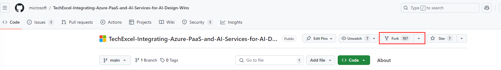
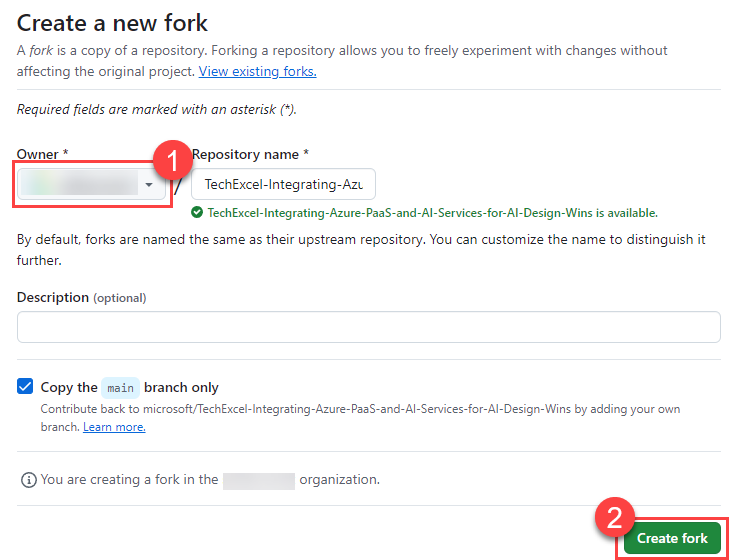
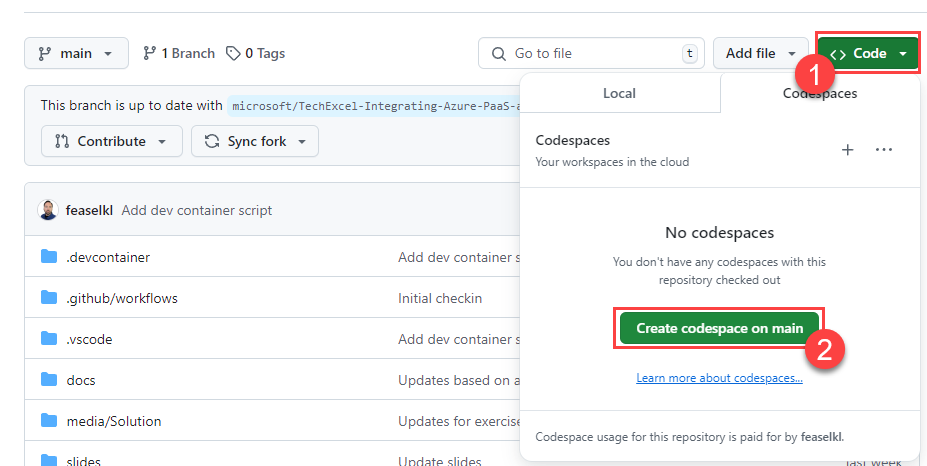
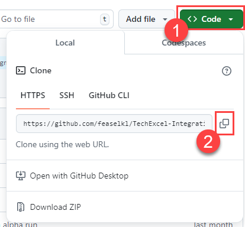

# Task 01 - Deploy resources via a Bicep script (20 minutes)

## Introduction

There are several client tools that you will use throughout this lab. These are standard tools for teams working with AI services from both Microsoft and other companies. The first task in this exercise is to prepare a machine--whether a virtual machine or your local computer--to perform these exercises. Then, you will deploy Azure resources via a Bicep script.

## Description

In this task, you will ensure that you have a particular set of tools installed on your own computer. Then, you will deploy resources to your Azure subscription using the Azure Developer CLI (azd).

## Success Criteria

- You have installed all necessary tools.
- You have cloned the GitHub repository to your local machine or virtual machine.
- You have deployed all necessary Azure services.

## Learning Resources

- Cloning a repository via the [command line](https://docs.github.com/en/github/creating-cloning-and-archiving-repositories/cloning-a-repository) or [GitHub Desktop](https://docs.github.com/en/desktop/contributing-and-collaborating-using-github-desktop/cloning-a-repository-from-github-to-github-desktop)
- [Creating a codespace for a repository](https://docs.github.com/en/codespaces/developing-in-a-codespace/creating-a-codespace-for-a-repository)
- [Azure Developer CLI (azd)](https://learn.microsoft.com/en-us/azure/developer/azure-developer-cli/overview?tabs=linux)

## Key Tasks

### 01: Fork the repository

Fork [this GitHub repository](https://github.com/microsoft/TechExcel-Integrating-Azure-PaaS-and-AI-Services-for-AI-Design-Wins) to your account. You will need to fork the repo in order to modify and use GitHub Actions workflows in later tasks.

<details markdown="block">
<summary><strong>Expand this section to view the solution</strong></summary>

In order to fork this repository, make sure that you are signed in to GitHub with the account you would like to use. Then, select the **Fork** button.



On the next page, select your account as the Owner and leave the repository name alone. Then, select **Create fork** to complete the process.



</details>

### 02: Prepare the workspace

Navigate to your forked repository if you have not already. Then, start up a GitHub Codespaces instance from your forked repository. This will likely take 5-10 minutes to complete and you may receive a message that "There are task errors" indicating that "there is no registered task type 'func'." This message is fine and is safe to ignore.

{: .note }
> You may alternatively choose to clone the GitHub repository to your local machine and then install the necessary software on your own machine, rather than using Codespaces. If you choose to install software separately, expand the following section to see what you need to install.
> If you are using an FDPO account, you should **not** use GitHub Codespaces for this lab. Instead, clone the repository to your local machine and ensure that you have necessary software installed.

<details markdown="block">
<summary><strong>Expand this section to view software to install in lieu of using GitHub Codespaces</strong></summary>

Ensure that you have the following software installed:

1. [Visual Studio Code](https://code.visualstudio.com/) (Alternatively, if you have Visual Studio installed, you can use that.)
2. Install the following extensions in Visual Studio Code:
    - [C# Dev Kit](https://marketplace.visualstudio.com/items?itemName=ms-dotnettools.csdevkit)
    - [Bicep](https://marketplace.visualstudio.com/items?itemName=ms-azuretools.vscode-bicep)
    - [Azure Functions extension](https://marketplace.visualstudio.com/items?itemName=ms-azuretools.vscode-azurefunctions)
    - [Azure Storage extension](https://marketplace.visualstudio.com/items?itemName=ms-azuretools.vscode-azurestorage)
3. Install the [Azure Functions Core Tools](https://learn.microsoft.com/azure/azure-functions/functions-run-local), which enables an integrated local debugging experience.
4. The [Microsoft .NET 8.0 SDK](https://dotnet.microsoft.com/download/dotnet/8.0). Ensure that you have the latest version of the SDK, not the Runtime.
5. The [Azure Command Line Interface](https://learn.microsoft.com/cli/azure/install-azure-cli).
6. The [Azure Developer CLI](https://learn.microsoft.com/en-us/azure/developer/azure-developer-cli/install-azd?tabs=winget-windows%2Cbrew-mac%2Cscript-linux&pivots=os-windows).
7. [A Git client](https://git-scm.com/download/). An alternative option is to install [GitHub Desktop](https://desktop.github.com/).
8. [Python 3.10 or later](https://www.python.org/downloads/). You can run all of the exercises in this lab using a standard installation of Python and do not need the Anaconda Distribution of Python. If you do have Anaconda, make sure that you can execute Python and pip commands from the command line.

    {: .note }
    > Regardless of which distribution you use, make sure that you can run `python` and `pip` from your command line. If you are not sure whether you have pip installed, run `python -m ensurepip` to check.

If you are working from a local machine or non-Codespaces VM, you will also need to clone your forked repository to the local machine.

</details>

{: .note }
> You may receive a message stating that it "Detected an Azure Functions Project" and asks if you wish to initialize it for optimal use with VS Code. It is safe to select **Yes** when you see this message. You will then **Overwrite** the tasks.json file.

<details markdown="block">
<summary><strong>Expand this section to view the solution</strong></summary>

If you are creating a GitHub Codespace, select the **Code** button on your repository. Then, in the **Codespaces** tab, select the **Create codespace on main** button. This will instantiate a Codespace.



If you are cloning your repository, select the **Code** button and then choose the **Local** tab. Copy the URL in the box. Then, to clone the repository, open a terminal and navigate to to the directory in which you'd like to clone your repository. Use the command `git clone {YOUR REPOSITORY URL}` to clone to this location.



</details>

### 03: Create a virtual environment

Create a new Python virtual environment called **aiwins** in the root directory of your cloned repository and activate it.

{: .note }
> A virtual environment (venv) is not absolutely necessary for this project but creating one will decrease the risk of library conflicts between this project and other Python projects you may have on your machine.

<details markdown="block">
<summary><strong>Expand this section to view the solution</strong></summary>

To create a virtual environment, perform the following steps:

1. Open up a terminal to the root directory of your Git repo. **For example**, if you cloned the repo to `C:\SourceCode\TechExcel-Integrating-Azure-PaaS-and-AI-Services-for-AI-Design-Wins`, open this directory in a command prompt. If you are using GitHub Codespaces, open a new terminal in Visual Studio Code--this will default you to the correct directory.
2. Run the following command: `python -m venv aiwins`. This will create a new virtual environment in the root directory named "aiwins" and make it available.
3. Run the following command to **activate** the virtual environment on MacOS or Linux (including GitHub Codespaces): `source aiwins/bin/activate`. If you are running this in Windows Subsystem for Linux, run the command `source aiwins/Scripts/active`. On Windows using CMD or PowerShell, use `aiwins\Scripts\activate.bat` to activate the virtual environment. Be sure to have the virtual environment active in every console or terminal you use throughout this training!

{: .note }
> In a normal terminal or command prompt, you will see `(aiwins)` before your input prompt. This will let you know that you are working in a Python virtual environment. If you are using the Visual Studio Code terminal, [this may not appear for technical reasons](https://github.com/microsoft/vscode-python/wiki/Activate-Environments-in-Terminal-Using-Environment-Variables). You can mouse over the terminal image to ensure that the virtual environment is active for your terminal.


{: .note }
> You will need to activate the virtual environment on every new terminal you use. When you are done, you can return to your standard Python environment by running `deactivate` in any environment. Alternatively, you may safely close the console or terminal without deactivation if you desire--it will not harm anything.

</details>

### 04: Install Python requirements

Install all requirements in the file `src/ContosoSuitesDashboard/requirements.txt`.

<details markdown="block">
<summary><strong>Expand this section to view the solution</strong></summary>

In order to install requirements, make sure that you are in a terminal connected to your virtual environment. Then, navigate to the `src/ContosoSuitesDashboard` folder and execute the command `pip install -r requirements.txt`. This will take several minutes to install but will include all of the Python package requirements necessary for the workshop.

</details>

### 05: Sign in to your Azure Tools

<details markdown="block">
<summary><strong>Expand this section to view the solution</strong></summary>
    
1. Using the **Terminal** window in VS Code, execute the following commands to login:

```bash
az login
azd auth login
```
{: .note }
> If you wish to use a subscription that does not belong to the **home** tenant of your user account, specify your TenantId by using the `--tenant <yourtenantid>` flag.

</details>

### 06: Deploy Azure resources

<details markdown="block">
<summary><strong>Expand this section to view the solution</strong></summary>

1. Using the **Terminal** window in VSCode, start the Azure Developer deployment process by running:
```bash
azd up
```
2. Enter a new environment name (i.e. 'techexcel1'). 
3. Select the desired target Azure subscription for deployment. This subscription **must** have access to Azure OpenAI.
4. Select a deployment location. **See notes below**

{: .important }
> You must deploy to an Azure region that supports the **GPT-4o, 2024-05-13** model. You must create your Azure OpenAI resource in one of the [supported regions](https://learn.microsoft.com/azure/ai-services/openai/concepts/models#model-summary-table-and-region-availability).

{: .important }
> Abstractive summarization in the Azure AI Services Language service is only supported in a subset of regions. You must create your Azure AI Language service in one of the [supported regions](https://learn.microsoft.com/azure/ai-services/language-service/summarization/region-support) to allow abstractive summarization to be performed in a later exercise.

5. Navigate to the **Users** blade in the Entra ID service for your Azure subscription. Find your user account and copy the **User principal name** and **Object ID** values. Use these values when prompted for the `SqlAdminUserName` and `SqlAdminSid` respectively. 

    {: .note }
    > You may receive an error while running this that you must accept the Responsible AI Notice before creating a TextAnalytics (Language) service. To do so, open the [Azure Portal](https://portal.azure.com/) and search for "Language" in the menu. Choose the **Language** service and then select Create. On the first page of the form, select the **Continue to create your resource** button at the bottom of the screen. Then, check the box certifying that you have reviewed and acknowledge the terms in the Responsible AI Notice. You can then close the Create Language page and try running the Bicep script again.

6. Once your deployment completes (about 5-10 minutes), you should see all of your resources in a new resource group based on your environment name (i.e. rg-techexcel1). These include: an API Management service, an App Service (for API), an App Service (for dashboard), an App Service plan (for API and dashboard), an App Service plan (for Function app), an Application Insights instance, an Azure Cosmos DB account, an Azure OpenAI workspace, a Container registry, a Function App, a Language service, a Log Analytics workspace, a Search service, a Speech service, a SQL database, a SQL server, and a Storage account.

</details>
