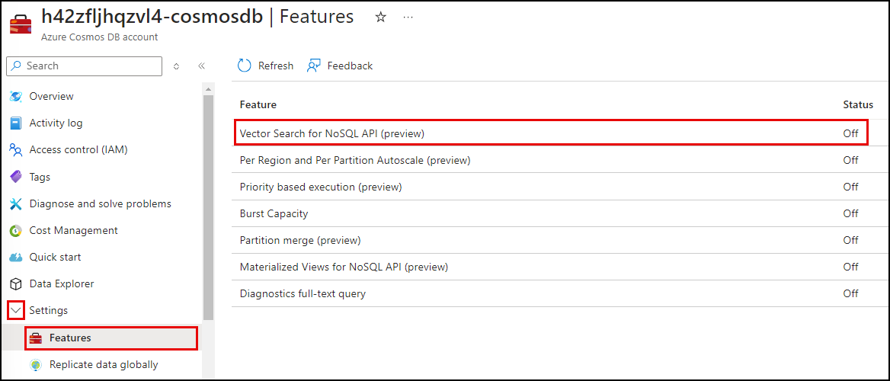

# Task 01 - Configure vector search in Azure Cosmos DB NoSQL (15 minutes)

## Introduction

Vector search is a technique that allows items to be found based on their data characteristics instead of exact matches on a specific property field. Instead of requiring exact matches, vector search enables you to find items based on their vector representations. This technique is advantageous when performing similarity searches and is particularly valuable in applications that need to search for information within large blocks of text, such as Consoso Suites' applications.

The Azure Cosmos DB for NoSQL API includes a vector search feature that provides a robust method for managing and querying high-dimensional vectors. This capability is essential for AI-driven applications requiring an integrated vector search capability. It allows you to store vectors alongside traditional schema-free data within your documents, streamlining data management and significantly enhancing the efficiency of vector operations. Keeping all relevant data in a single logical unit simplifies your data architecture, making it easy to understand and manage, making it easy to understand and manage.

## Description

In this task, you will enable the Vector Search feature in your Azure Cosmos DB for NoSQL database, define container vector policies, and specify indexing policies on Cosmos DB containers you will create for storing user reviews and property maintenance data.

You will conclude by uploading data supplied by the Contoso Suites staff into the containers you created in Cosmos DB. These JSON data files contain user reviews and maintenance tasks for several hotels on their resorts. They offer an example of the types of data the company believes can benefit from the similarity search capabilities provided by Vector Search in Cosmos DB, so they would like you to incorporate this data into the proof of concept.

The key tasks are as follows:

1. Enable the Vector Search feature in Azure Cosmos DB for NoSQL.
2. Create containers named "UserReviews" and "MaintenanceTasks" in the `ContosoSuites` database, using the `hotel_id` field as the partition key.
3. During container creation, define a container vector policy using the `cosine` distance function and assign an appropriate vector index type. Name the vector field `vector_embeddings` for each.
4. Populate the containers with data from files in the [/src/data folder](https://github.com/microsoft/TechExcel-Integrating-Azure-PaaS-and-AI-Services-for-AI-Design-Wins/tree/main/src/data) of the repository.
   1. The `UserReviews` container should be populated from the `UserReviews.json` file.
   2. Populate the `MaintenanceTasks` container with data from the file named `PropertyMaintenance.json`.

## Success Criteria

- You have enabled the Vector Search for NoSQL API feature in your Azure Cosmos DB instance.
- You have defined a vector policy for the `UserReviews` and `MaintenanceTasks` containers in the `ContosoSuites` database in Azure Cosmos DB.
- You have set appropriate vector indexing policies on both containers to improve similarity search efficiency.
- You have populated both containers with data.

## Learning Resources

- [What is a vector database?](https://learn.microsoft.com/azure/cosmos-db/vector-database)
- [What are vector embeddings?](https://learn.microsoft.com/azure/cosmos-db/gen-ai/vector-embeddings)
- [What is vector search?](https://learn.microsoft.com/azure/cosmos-db/gen-ai/vector-search-overview)
- [Vector Search in Azure Cosmos DB for NoSQL](https://learn.microsoft.com/azure/cosmos-db/nosql/vector-search)
- [What are distance functions?](https://learn.microsoft.com/azure/cosmos-db/gen-ai/distance-functions)

## Solution

<details markdown="block">
<summary>Expand this section to view the solution</summary>

- Enabling the Vector Search for NoSQL API feature in Azure Cosmos DB, can be done via the Azure portal or the Azure CLI. The steps for each technique are listed below. Note that enabling the registration may take several minutes to take effect.
  - The steps for enabling the feature in the Azure portal are as follows:
    1. Navigate to your Azure Cosmos DB for NoSQL resource in the [Azure portal](https://portal.azure.com).
    2. Expand the **Settings** item in the left-hand menu, select **Features**, and on the **Features** page, select **Vector Search for NoSQL API**.

        

    3. In the **Vector Search for NoSQL API** dialog, review the feature description and select **Enable**.

        

    4. Wait for the notification that the feature was successfully enabled.

  - To enable Vector Search via the Azure CLI:
    1. Execute the following command from the Azure Cloud Shell. Ensure you replace the `<resource-group-name>` and `<account-name>` tokens with the values from your deployed resource group.

        ```azurecli
        az cosmosdb update \
            --resource-group <resource-group-name> \
            --name <account-name> \
            --capabilities EnableNoSQLVectorSearch
        ```

    2. Wait for the command to run successfully before leaving the Azure Cloud Shell.

- Container vector policies and vector indexing policies must be defined at the time of container creation.
  - In the [Azure portal](https://portal.azure.com), navigate to your Cosmos DB resource.
  - Select **Data Explorer** in the left-hand menu.
  - On the **Data Explorer** page, select **New Container**
  - In the **New Container** dialog:
    - Select **Use existing** under **Database id** and select the **ContosoSuites** database from the dropdown list.
    - Enter "UserReviews" into the **Container id** box.
    - Enter "/hotel" into the **Partition key** box.
    - Expand the **Container Vectory Policy** section of the dialog and select **Add vector embedding**.
      - Path: Enter "/vector_embeddings"
      - Data type: Select **float32**.
      - Distance function: Select **cosine**.
      - Dimensions: Enter **1536**. This is based on the number of dimensions generated by the `ada-text-embedding-002` model in Azure OpenAI.
      - Index type: Select **quantizedFlat**. Given the number of dimensions being specified, 1536, the `flat` index type would not be appropriate, as it only supports a maximum of 505 dimensions for vectors. The `diskANN` index could also be used here, but is only available in a limited preview at this time.
    - Select **OK** to create the container.
  - Repeat the above steps to create a second container named "MaintenanceTasks."

- The Azure Cosmos DB Data Explorer can be used to upload the data files provided by Contoso Suites.
  - In the [Azure portal](https://portal.azure.com), navigate to your Cosmos DB resource and select **Data Explorer** in the left-hand menu.
  - In the Data Explorer, expand the **ContosoSuites** database and the **UserReviews** container, then select **Items**.

    

  - Select **Upload Item** on the toolbar.

    

  - In the **Upload Items** dialog, select the browse button and navigate to the `UserReviews.json` file in the `/src/data` directory in the location where cloned the repository, then select **Upload** to import the data in the file.

    

  - Repeat the above steps, this time uploading data into the `MaintenanceTasks` container from the `PropertyMaintenance.json` file.

</details>
