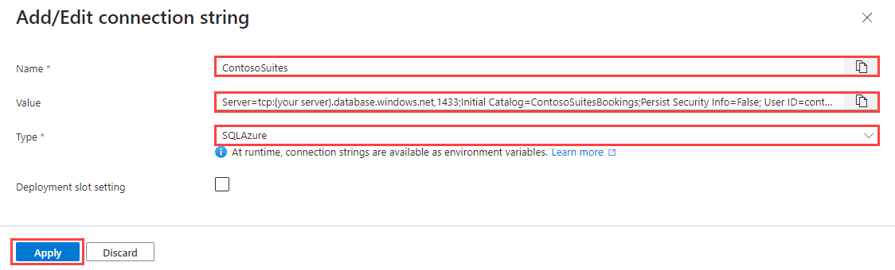

# Task 01 - Prepare an Azure SQL Database (20 minutes)

## Introduction

The Contoso Suites team is interested in learning how they can use Semantic Kernel to extend their application capabilities. The development team is currently responsible for creating any new API endpoints that end users will consume through front-end applications, but a common complaint is that the turnaround time for new API endpoint is too slow. The development team is interested in learning more about Semantic Kernel and whether it could be a viable solution for their problem.

Throughout the course of this exercise, you will complete a simple Web API to support database calls. Then, you will implement a Semantic Kernel plugin to enable arbitrary database query generation (of `SELECT` statements), and display the results as a table in the front-end application.

In this first task, you will prepare an Azure SQL Database and wire up function calls from a C#-based Web API project to read from the Azure SQL Database. You will then deploy the Web API project and ensure that your Streamlit-based dashboard application can successfully read data from Azure SQL Database via the Web API project. This will prepare you for Task 2, where you will enable your GPT-4 model deployment to generate function calls based on chat input.

## Description

In this task, you will load data that Contoso Suites staff has provided to you into Azure SQL DB. This data contains a sample of customer, hotel, and bookings data from their SQL Server-based bookings system. From there, they would like you to implement a .NET Web API endpoint exposing this customer information. They have provided you with most of the code but did not have time to complete the task.

## Success Criteria

- You have created a series of tables in the ContosoSuitesBookings Azure SQL Database.
- You have added a sql db user for your User-assigned Managed Identity.
- You have updated the .NET Web API endpoint to allow querying against hotel and bookings data.

## Tips

- If your .NET application build is failing when you try to run `dotnet run` and you receive an error that the build cannot load the required packages from NuGet, you may be missing a link to the Microsoft NuGet repository. Run the command `dotnet nuget list source` and see if you have an entry enabled for nuget.org. If not, you can add it with the following command: `dotnet nuget add source https://api.nuget.org/v3/index.json -n nuget.org`. If you have one but it is currently disabled, you can enable it with the command `dotnet nuget enable source nuget.org`.

## Learning Resources

- [Azure SQL Database and Azure Synapse IP firewall rules](https://learn.microsoft.com/azure/azure-sql/database/firewall-configure?view=azuresql)
- [Environment variables and app settings in Azure App Service](https://learn.microsoft.com/azure/app-service/reference-app-settings?tabs=kudu%2Cdotnet)

## Key Tasks

### 01: Set firewall rules

Add your IP address to your Azure SQL Server's firewall allow list and also enable the **Allow Azure services and resources to access this server** setting.

<details markdown="block">
<summary><strong>Expand this section to view the solution</strong></summary>

To add your IP address to the Azure SQL Server's firewall allow list, first navigate to [the Azure portal](https://portal.azure.com). From there, find your resource group and select the **SQL server** service. In the **Security** menu on the left-hand side, choose the **Networking** option. Then, select the **Add your client IPv4 address** option in the **Firewall rules** heading. Select the **Allow Azure services and resources to access this server** checkbox and then select **Save** to save your changes.


</details>

### 02: Load sample data

Connect to your remote Azure SQL Database and run the script in `src/data/BookingsHistory.sql` against that database, creating several tables and populating them with sample data. Then, run the script `src/data/AddManagedIdentityUser.sql` replacing the name **TechExcelMI** with the name of the User-assigned Managed Identity that was created in your resource group.

<details markdown="block">
<summary><strong>Expand this section to view the solution</strong></summary>

If you have a tool such as SQL Server Management Studio or Azure Data Studio already installed, you can connect to your Azure SQL Database via its endpoint--the server name in your SQL connection string. If you do not have a database tool installed, navigate to the **ContosoSuitesBookings** database in your resource group. Then, on the left-hand menu, select the **Query editor (preview)** menu option. Log in with your Entra ID user account. From there, you can paste the contents of `src/data/BookingsHistory.sql` to create the bookings history tables and load them with sample data. Next, open the `src/data/AddManagedIdentityUser.sql` script and replace **TechExcelMI** with the name of the User-assigned Managed Identity from your resource group.

</details>

### 03: Create a local connection string

Create the `ContosoSuites` connection string in your local `src/ContosoSuitesWebAPI/appsettings.Development.json` file for your Azure SQL DB. Use Active Directory Default authentication.

<details markdown="block">
<summary><strong>Expand this section to view the solution</strong></summary>

1. Create a new  local `src/ContosoSuitesWebAPI/appsettings.Development.json` file.
2. Update the **{your server}** value inside the `ContosoSuites` connection string with your Azure SQL DB server name.

The complete `appsettings.Development.json` file should look like this:

```json
{
  "ConnectionStrings": {
    "ContosoSuites": "Server=tcp:{your server}.database.windows.net,1433;Initial Catalog=ContosoSuitesBookings;Encrypt=True;TrustServerCertificate=False;Connection Timeout=30;Authentication='Active Directory Default';"
  }
}
```

> Notice that we are not setting this vaule in the main `appsettings.json` file to avoid pushing secrets to your git repo.

</details>

### 04: Update endpoint code

Complete the function mappings in `src/ContosoSuitesWebAPI/Program.cs` for the `/Hotels/` endpoints. Each endpoint should call the relevant database service and return the results of the appropriate method.

<details markdown="block">
<summary><strong>Expand this section to view the solution</strong></summary>

The completed code for the three Hotels endpoints in `Program.cs` are as follows:

```csharp
// Retrieve the set of hotels from the database.
app.MapGet("/Hotels", async () => 
{
    var hotels = await app.Services.GetRequiredService<IDatabaseService>().GetHotels();
    return hotels;
})
    .WithName("GetHotels")
    .WithOpenApi();

// Retrieve the bookings for a specific hotel.
app.MapGet("/Hotels/{hotelId}/Bookings/", async (int hotelId) => 
{
    var bookings = await app.Services.GetRequiredService<IDatabaseService>().GetBookingsForHotel(hotelId);
    return bookings;
})
    .WithName("GetBookingsForHotel")
    .WithOpenApi();

// Retrieve the bookings for a specific hotel that are after a specified date.
app.MapGet("/Hotels/{hotelId}/Bookings/{min_date}", async (int hotelId, DateTime min_date) => 
{
    var bookings = await app.Services.GetRequiredService<IDatabaseService>().GetBookingsByHotelAndMinimumDate(hotelId, min_date);
    return bookings;
})
    .WithName("GetRecentBookingsForHotel")
    .WithOpenApi();
```

</details>

### 05: Test Web API service

Build and run the Web API service locally. Connect to the URL provided in the **"Now listening on:"** line and navigate to the `/Hotels` endpoint. For example, if your host is localhost and on port 5292, navigate to `http://localhost:5292/Hotels`. You should see a list of four hotels. Test the other two endpoints as well.

{: .note }
> If you are using GitHub Codespaces, select the **Open in Browser** button when you receive an informational message that "Your application running on port 5292 is available." From there, you can navigate to the `/Hotels` endpoint in your browser.

<details markdown="block">
<summary><strong>Expand this section to view the solution</strong></summary>

To run the .NET Web API application, navigate to the `src/ContosoSuitesWebAPI/` folder in your terminal. This terminal should have access to the `SQLAZURECONNSTR_ContosoSuites` environment variable. Then, run the following commands to restore NuGet packages, build the project, and run the project.

```csharp
dotnet restore
dotnet build
dotnet run
```

</details>

### 06: View API Integration page

Open the Streamlit application and navigate to the **API Integration** page. You should see a drop-down list asking you to select a hotel, followed by a table of bookings for that hotel.

### 07: Deploy Web API service

Deploy your App Service code changes and ensure they propagate to Azure App Services. Then, add a new connection string to the App Service's environment variables called `ContosoSuites`. The Value should be the value of your connection string and the Type should be **SQLAzure**. Azure App Services will automatically add the `SQLAZURECONNSTR_` to the beginning of your environment variable, so you should not add it yourself when creating this variable.

<details markdown="block">
<summary><strong>Expand this section to view the solution</strong></summary>

In order to create an environment variable for your App Service, perform the following actions.

1. Navigate back to your resource group in the Azure Portal. Then, select the **App Service** named `{your_unique_id}-api`. In the **Settings** menu, choose the **Environment variables** option. Then, navigate to the **Connection strings** tab and select the **Add** button.

    

2. Enter `ContosoSuites` as the Name and then fill in your connection string for Value. For Type, select **SQLAzure** from the drop-down. Then, select the **Save** button to save this environment variable.

    

After saving your changes, select the **Apply** button to finish saving the new connection string. This will restart your API service.

</details>

### 08: Test dashboard application

Test your deployed Streamlit application and ensure that it is able to load the hotels drop-down list and bookings table as expected.

{: .note }
> If you receive an error message indicating a timeout against the API server, you may need to stop and restart the API App Service and then wait a couple of minutes for it to be ready.
