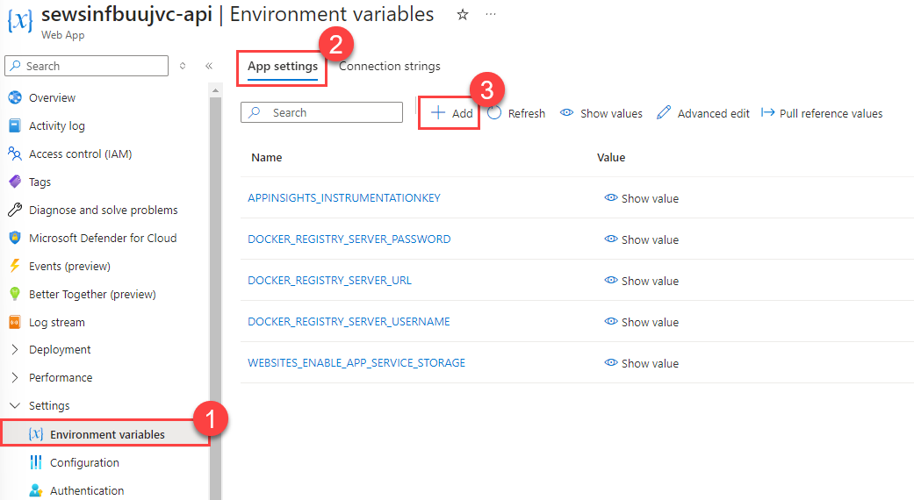

# Task 02 - Create a function call for the customer account information API endpoint (40 minutes)

## Introduction

Using the Semantic Kernel library, you can translate natural language input into a function call. This allows organizations to extend existing code bases and APIs with a natural language front end.

We currently have three Web API endpoints reading data from Azure SQL Database. In this task, you will create two additional endpoints for reading data, as well as a general-purpose endpoint to accept natural language input and return the appropriate output based on user request. This approach to querying data can be more intuitive for end users who have some familiarity with the specific capabilities of our API.

## Description

In the prior task, you populated bookings history data in Azure SQL Database and built three endpoints on top of it. The Contoso Suites development team would like to continue building API endpoints, but want to take advantage of natural language capabilities to make front-end development easier. In this task, you will use the Semantic Kernel library to make the database service calls into kernel functions that can run based on user request.

## Success Criteria

- You have added two new methods to the `IDatabaseService` interface and its associated `DatabaseService` class.
- You have implemented the Chat endpoint and can call any of the `DatabaseService` functions.
- You are able to interact with the Chat endpoint from the **API Integration** page in Streamlit.

## Learning Resources

- [Booking Restaurant - Demo Application](https://github.com/microsoft/semantic-kernel/tree/main/dotnet/samples/Demos/BookingRestaurant)
- [Save storage of app secrets in development in ASP.NET Core](https://learn.microsoft.com/aspnet/core/security/app-secrets?view=aspnetcore-8.0&tabs=windows)
- [dotnet add package](https://learn.microsoft.com/dotnet/core/tools/dotnet-add-package)
- [Introduction to Semantic Kernel](https://learn.microsoft.com/semantic-kernel/overview/)
- [KernelFunction Class](https://learn.microsoft.com/dotnet/api/microsoft.semantickernel.kernelfunction?view=semantic-kernel-dotnet)
- [ConfigurationBuilder Class](https://learn.microsoft.com/dotnet/api/microsoft.extensions.configuration.configurationbuilder?view=net-8.0)
- [IKernelBuilder Interface](https://learn.microsoft.com/dotnet/api/microsoft.semantickernel.ikernelbuilder?view=semantic-kernel-dotnet)
- [KernelExtensions.AddFromType Method](https://learn.microsoft.com/dotnet/api/microsoft.semantickernel.kernelextensions.addfromtype?view=semantic-kernel-dotnet)
- [Environment variables and app settings in Azure App Service](https://learn.microsoft.com/azure/app-service/reference-app-settings?tabs=kudu%2Cdotnet)

## Tips

- The Semantic Kernel .NET library is rapidly changing, and some examples you may find online relate to the old methods for interacting with Semantic Kernel. Furthermore, if you are using GitHub Copilot to assist with development, it may provide you with code that no longer functions with recent versions of Semantic Kernel. Be sure to use recent code examples as guidance.

## Key Tasks

### 01: Add local secrets

Add three local secrets to the `src/ContosoSuitesWebAPI` project using `dotnet user-secrets`. They should be named `AzureOpenAI:DeploymentName`, `AzureOpenAI:Endpoint`, and `AzureOpenAI:ApiKey`, and these secret names are case-sensitive.

<details markdown="block">
<summary><strong>Expand this section to view the solution</strong></summary>

In order to add user secrets to your .NET project, open a console in the Web API directory containing your `ContosoSuitesWebAPI.csproj` file. Then, run the following commands, replacing the secret values with your actual endpoint and API key, respectively.

```sh
dotnet user-secrets init
dotnet user-secrets set "AzureOpenAI:DeploymentName" "gpt-4o"
dotnet user-secrets set "AzureOpenAI:Endpoint" "{your_endpoint}"
dotnet user-secrets set "AzureOpenAI:ApiKey" "{your_key}"
```

</details>

### 02: Update database service code

The `DatabaseService` class and `IDatabaseService` interface have three methods associated with them. Contoso Suites would like to add two more methods. One will be called `GetBookingsMissingHotelRooms()` and will return all bookings that do not have associated hotel rooms. The second will be called `GetBookingsWithMultipleHotelRooms()` and will return all bookings with more than one hotel room. Neither method should take an input parameter, and you will not need to add explicit endpoints for these.

<details markdown="block">
<summary><strong>Expand this section to view the solution</strong></summary>

The code for the `GetBookingsMissingHotelRooms()` method is in the `DatabaseService` class as follows:

```csharp
public async Task<IEnumerable<Booking>> GetBookingsMissingHotelRooms()
    {
        var sql = """
            SELECT
                b.BookingID,
                b.CustomerID,
                b.HotelID,
                b.StayBeginDate,
                b.StayEndDate,
                b.NumberOfGuests
            FROM dbo.Booking b
            WHERE NOT EXISTS
                (
                    SELECT 1
                    FROM dbo.BookingHotelRoom h
                    WHERE
                        b.BookingID = h.BookingID
                );
            """;
        using var conn = new SqlConnection(
            connectionString: connectionString!
        );
        conn.Open();
        using var cmd = new SqlCommand(sql, conn);
        using var reader = await cmd.ExecuteReaderAsync();
        var bookings = new List<Booking>();
        while (await reader.ReadAsync())
        {
            bookings.Add(new Booking
            {
                BookingID = reader.GetInt32(0),
                CustomerID = reader.GetInt32(1),
                HotelID = reader.GetInt32(2),
                StayBeginDate = reader.GetDateTime(3),
                StayEndDate = reader.GetDateTime(4),
                NumberOfGuests = reader.GetInt32(5)
            });
        }
        conn.Close();

        return bookings;
    }
```

The code for the `GetBookingsWithMultipleHotelRooms()` method in the `DatabaseService` class is as follows:

```csharp
public async Task<IEnumerable<Booking>> GetBookingsWithMultipleHotelRooms()
    {
        var sql = """
            SELECT
                b.BookingID,
                b.CustomerID,
                b.HotelID,
                b.StayBeginDate,
                b.StayEndDate,
                b.NumberOfGuests
            FROM dbo.Booking b
            WHERE
                (
                    SELECT COUNT(1)
                    FROM dbo.BookingHotelRoom h
                    WHERE
                        b.BookingID = h.BookingID
                ) > 1;
            """;
        using var conn = new SqlConnection(
            connectionString: connectionString!
        );
        conn.Open();
        using var cmd = new SqlCommand(sql, conn);
        using var reader = await cmd.ExecuteReaderAsync();
        var bookings = new List<Booking>();
        while (await reader.ReadAsync())
        {
            bookings.Add(new Booking
            {
                BookingID = reader.GetInt32(0),
                CustomerID = reader.GetInt32(1),
                HotelID = reader.GetInt32(2),
                StayBeginDate = reader.GetDateTime(3),
                StayEndDate = reader.GetDateTime(4),
                NumberOfGuests = reader.GetInt32(5)
            });
        }
        conn.Close();

        return bookings;
    }
```

The new code for the `IDatabaseService` interface is as follows:

```csharp
Task<IEnumerable<Booking>> GetBookingsMissingHotelRooms();
    Task<IEnumerable<Booking>> GetBookingsWithMultipleHotelRooms();
```

</details>

### 03: Add Semantic Kernel package

Add the Semantic Kernel version 1.20.0 NuGet package to the Web API project.

<details markdown="block">
<summary><strong>Expand this section to view the solution</strong></summary>

To add the Semantic Kernel NuGet package, you can run the following command from the command line, in the Web API directory containing your `ContosoSuitesWebAPI.csproj` file.

```powershell
dotnet add package Microsoft.SemanticKernel --version 1.20.0
```

</details>

### 04: Apply tags to database service methods

Tag each of the methods in the `DatabaseService` class as kernel functions and provide a description for each method and input parameter.

<details markdown="block">
<summary><strong>Expand this section to view the solution</strong></summary>

In order to tag a method in the `DatabaseService.cs` file, you will need to include the `Microsoft.SemanticKernel` and `System.ComponentModel` namespaces at the top of the file, along with the other **using** statements.

```csharp
using Microsoft.SemanticKernel;
using System.ComponentModel;
```

Then, add `[KernelFunction]` and `[Description()]` descriptors to each of the five methods you want to be available for Semantic Kernel to call.   For example, the `GetHotels()` method   signature would look like:

```csharp
[KernelFunction]
    [Description("Get all hotels.")]
    public async Task<IEnumerable<Hotel>> GetHotels()
```

For methods with parameters, include as well a `[Description()]` descriptor for each parameter. For example, the `GetBookingsForHotel()` method   would look like:

```csharp
[KernelFunction]
    [Description("Get all bookings for a single hotel.")]
    public async Task<IEnumerable<Booking>> GetBookingsForHotel(
        [Description("The ID of the hotel")] int hotelId
        )
```

Make sure to do this for all five methods, including the two you created in Step 2 of this task.

</details>

### 05: Use configuration builder

The `AppConfig.cs` file contains a simple configuration class. Update the `Program.cs` file to use this configuration class to build out a configuration. Add in any user secrets associated with the (implicit) `Program` class as well as environment variables, and then validate the configuration.

<details markdown="block">
<summary><strong>Expand this section to view the solution</strong></summary>

Add the Semantic Kernel namespaces we will need to the top of `Program.cs`:

```csharp
using Microsoft.SemanticKernel;
using Microsoft.SemanticKernel.Connectors.OpenAI;
using Microsoft.SemanticKernel.ChatCompletion;
```

From there, after creating the **builder** object, add the following code:

```csharp
var config = new ConfigurationBuilder()
    .AddUserSecrets<Program>()
    .AddEnvironmentVariables()
    .Build();
```

</details>

### 06: Add Semantic Kernel singleton

In `Program.cs`, add a singleton of type `Microsoft.SemanticKernel.Kernel`. It should create an `IKernelBuilder` and then add Azure OpenAI chat completion, using the deployment name, endpoint, and API key from your configuration. It should also add as a plugin everything in the `DatabaseService` class.

<details markdown="block">
<summary><strong>Expand this section to view the solution</strong></summary>

The code to create a singleton `Kernel` is as follows, and should be added below the singleton builder for `CosmosClient`.

```csharp
builder.Services.AddSingleton<Kernel>((_) =>
{
    IKernelBuilder kernelBuilder = Kernel.CreateBuilder();
    kernelBuilder.AddAzureOpenAIChatCompletion(
        deploymentName: builder.Configuration["AzureOpenAI:DeploymentName"]!,
        endpoint: builder.Configuration["AzureOpenAI:Endpoint"]!,
        apiKey: builder.Configuration["AzureOpenAI:ApiKey"]!
    );
    var databaseService = _.GetRequiredService<IDatabaseService>();
    kernelBuilder.Plugins.AddFromObject(databaseService);
    return kernelBuilder.Build();
});
```

</details>

### 07: Implement chat request

Implement the `/Chat` POST request. It should use the `Kernel` singleton and get chat message content from the chat completion service. Return to the end user `response?.Content!`.

<details markdown="block">
<summary><strong>Expand this section to view the solution</strong></summary>

The code to implement the `/Chat` POST request is as follows:

```csharp
app.MapPost("/Chat", async Task<string> (HttpRequest request) =>
{
    var message = await Task.FromResult(request.Form["message"]);
    var kernel = app.Services.GetRequiredService<Kernel>();
    var chatCompletionService = kernel.GetRequiredService<IChatCompletionService>();
    var executionSettings = new OpenAIPromptExecutionSettings
    {
        ToolCallBehavior = ToolCallBehavior.AutoInvokeKernelFunctions
    };
    var response = await chatCompletionService.GetChatMessageContentAsync(message.ToString(), executionSettings, kernel);
    return response?.Content!;
})
    .WithName("Chat")
    .WithOpenApi();
```

</details>

### 08: Test Web API project

1. Run the Web API project and ensure that things work correctly. If you are using GitHub Codespaces, run the following command:

   ```bash
   curl -d 'message="Which bookings do not currently have hotel rooms associated with them?"' http://localhost:5292/Chat
   ```

   You can alternatively perform a simple test in PowerShell using the following request.

    ```powershell
    $postParams = @{ message="Which bookings do not currently have hotel rooms associated with them?" }
    Invoke-WebRequest -Uri http://localhost:5292/Chat -Method POST -Body $postParams
    ```

    Change the `-Uri` parameter as needed, if your local port is not 5292.
2. With the Web API package running, run your Streamlit front end and navigate to the **API Integration** page. Ask the following questions and ensure that you get back the results you expect.
   1. Please show me the bookings for hotel 3 for any date later than December 1, 2024.
   2. Which bookings currently do not have hotel rooms assigned to them?
   3. How many bookings have included at least two hotel rooms?

### 09: Deploy to App Service

Deploy your App Service code changes and ensure they propagate to Azure App Services. Then, add a three new environment variables to the App Service: `AzureOpenAI__ApiKey`. This environment variables should have **two** underscores between "AzureOpenAI" and the name.

{: .important }
> In a production environment, it would be better to save these as secrets in Azure Key Vault and then enable a managed identity to access the Key Vault secrets from your App Service. The reason for this is, with the current configuration, anyone with access to manage the App Service can view the deployment name, endpoint, and API key secrets.

<details markdown="block">
<summary><strong>Expand this section to view the solution</strong></summary>

In order to create an environment variable for your App Service, perform the following actions.
1. Navigate back to your resource group in the Azure Portal. Then, select the **App Service** named `{your_unique_id}-api`. In the **Settings**   menu, choose the **Environment variables** option. Then, navigate to the **App settings** tab and select the **Add** button.

    

2. Create the`AzureOpenAI__ApiKey` which should have a value of   your Azure OpenAI API key. After entering data for an application setting, select **Apply** to save the setting.

    

{: .note }
> These environment variables should have **two** underscores between "AzureOpenAI" and the name.

After creating the three application settings, select the **Apply** button to finish saving them. This will restart your API service.

</details>

Once the deployment has finished, test your deployed Streamlit application and ensure that it is able to answer user questions about bookings as expected.
