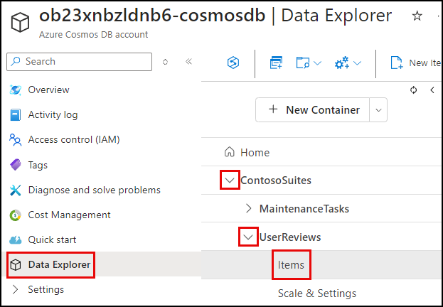
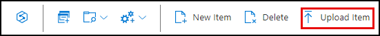
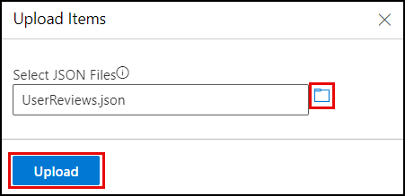

# Task 02 - Create and store vector embeddings (30 minutes)

## Introduction

Vectors, also known as embeddings or vector embeddings, are mathematical representations of data in a high-dimensional space. In this space, each dimension corresponds to a feature of the data, and tens of thousands of dimensions might be used to represent sophisticated data. A vector's position in this space represents its characteristics. Words, phrases, or entire documents, and images, audio, and other types of data can all be vectorized. An embedding is a special format of data representation that can be easily utilized by machine learning models and algorithms. The embedding is an information dense representation of the semantic meaning of a piece of text. Each embedding is a vector of floating point numbers, such that the distance between two embeddings in the vector space is correlated with semantic similarity between two inputs in the original format. Azure OpenAI provides several models for creating vector embeddings, and for this exercise, you will use the `text-embedding-ada-002` model.

To store the generated embeddings, you will use a vector database. Vector datasbases are designed to store and manage vector embeddings. The vector database you will use is Azure Cosmos DB for NoSQL. It allows you to store vectors alongside traditional schema-free data within your documents, streamlining data management and significantly enhancing the efficiency of vector operations. Keeping all relevant data in a single logical unit simplifies your data architecture, making it easy to understand and manage.

## Description

In the prior task, you configured Azure Cosmos DB for NoSQL as an integrated vector database. In this task, you will use an Azure Function, Azure OpenAI, and the Azure Cosmos DB change feed to generate vector embeddings for property maintenance requests and save those into the `MaintenanceRequests` container in Cosmos DB.

You will conclude by uploading data supplied by the Contoso Suites staff into the `MaintenanceRequests` container you created in Cosmos DB and allowing the deployed function app to generate vectors for each record. The JSON data files provided by Contoso Suites contain maintenance requests for several hotels on their resorts. They offer an example of the types of data the company believes can benefit from the similarity search capabilities provided by Vector Search in Cosmos DB for NoSQL, so they would like you to incorporate this data into the proof of concept.

The key tasks are as follows:

1. Review the Azure Function code in the `CosmosChangeFeedVectorization.cs` file in the `src/ContosoSuitesVectorizationFunction` folder. The function:
   1. Is triggered whenever a document is inserted or updated in the `MaintenanceRequests` container using the Azure Cosmos DB change feed.
   2. Vectorizes text in the `details` field of a maintenance request using a `text-embedding-ada-002` model in Azure OpenAI.
   3. Writes generated vectors into the `request_embeddings` fields of the document and updates it in the `MaintenanceRequests` container.
   4. Marks the document as "Vectorized."
2. Create a `local.settings.json` file in the `src/ContosoSuitesVectorizationFunction` folder and populate it with the settings needed by the function to run the function locally. Hint, the required values can be identified using the calls to `Environment.GetEnvironmentVariable` in the `CosmosChangeFeedVectorization.cs` file, as well as providing the Cosmos DB connection string required by the input and output bindings of the function.
3. Test the function locally and evaluate the inputs and outputs of the function.
   1. Use breakpoints in the function's `Run` method to examine the input collection and processing that occurs as a new record is added.
   2. After starting a local debug session, insert the following document into the `MaintenanceRequests` container and observe the results of the function execution as your breakpoints are hit.

        ```json
        {
          "hotel_id": 1, 
          "hotel": "Oceanview Inn",
          "source": "customer",
          "date": "2024-08-10",
          "details": "The air conditioning (A/C) unit in room 227 is malfunctioning and making a loud noise. Customer will be out of the room between 5:00 and 8:30 PM this evening. This needs immediate maintenance attention. If the issue cannot be resolved, we will need to move the customer to a new room.",
          "room_number": 227
        }
        ```

   3. Once the function execution completes, examine the document in Cosmos DB and inspect the vector embeddings inserted into `request_vector` field of the document.
4. Use VS Code to deploy the function to a new Azure Function App in your resource group and add the required app configuration settings.
5. Navigate to the live screen and watch the logs.
6. Populate the `MaintenanceRequests` container with data from the `PropertyMaintenance.json` file in the [/src/data folder](https://github.com/microsoft/TechExcel-Integrating-Azure-PaaS-and-AI-Services-for-AI-Design-Wins/tree/main/src/data) of the repository.
7. Observe the files being processed.
8. Review data in data explorer to confirm the function is correctly populating the `request_vector` field for newly added documents.
9. Execute a `VectorDistance()` query via Data Explorer.
   1. Create new query.
   2. Add query below...
   3. Observe results and `SimilarityScore` values.

## Success Criteria

- You have tested the function locally and deployed it to Azure.
- You have successfully created vector embeddings for each document in the `PropertyMaintenance.json` file using the deployed Function App.
- You have executed a `VectorDistance()` function via the Cosmos DB Data Explorer.

## Learning Resources

- [What are vector embeddings?](https://learn.microsoft.com/azure/cosmos-db/gen-ai/vector-embeddings)
- [Understand embeddings in Azure OpenAI service](https://learn.microsoft.com/azure/ai-services/openai/concepts/understand-embeddings)
- [Azure OpenAI embeddings models](https://learn.microsoft.com/azure/ai-services/openai/concepts/models#embeddings-models)
- [VectorDistance (NoSQL query)](https://learn.microsoft.com/azure/cosmos-db/nosql/query/vectordistance)
- [OpenAI Inference](https://learn.microsoft.com/dotnet/api/overview/azure/ai.openai-readme?view=azure-dotnet-preview)
- [AzureOpenAIClient class](https://learn.microsoft.com/dotnet/api/azure.ai.openai.azureopenaiclient?view=azure-dotnet-preview)

## Solution

<details markdown="block">
<summary>Expand this section to view the solution</summary>

- The steps to review the function app are as follows:
  - Open the `CosmosChangeFeedVectorization.cs` file in the `src/ContosoSuitesVectorizationFunction` folder.
  - Locate the `Run` function starting on line 43 and examine the code contained within it.
    - The code on line 50 reduces the list of documents sent to the function to only those that do not have a `Type` of "Vectorized". This prevents the updates pushed by the function back to the `MaintenanceRequests` container from being revectorized by the function.
    - If there are no documents that require vectorization, the function will exit without making any changes to the input documents.
    - The `foreach` loop starting on line 53 iterates through each document in the change feed that requires the text in its `details` field to be vectorized. The `details` text is sent to Azure OpenAI to create vector embeddings using the deployment for the `text-embedding-ada-002` model. The returned vector embeddings are saved into the `RequestVector` field of the document.
    - The document's `Type` field is set to "Vectorized".
    - On line 73, the list of input documents is returned, which used the Cosmos DB output binding to write the updated documents back into the `MaintenanceRequests` container.

- To create a `local.settings.json` file, navigate to the `src/ContosoSuitesVectorizationFunction` directory, create a new file named `local.settings.json`, and add the following content, replacing the bracketed tokens with values from your Azure OpenAI and Azure Cosmos DB services.

    ```json
    {
      "IsEncrypted": false,
      "Values": {
        "AzureWebJobsStorage": "",
        "FUNCTIONS_WORKER_RUNTIME": "dotnet-isolated",
        "AzureOpenAIEndpont": "[YOUR_AZURE_OPENAI_ENDPOINT]",
        "AzureOpenAIKey": "[YOUR_AZURE_OPENAI_KEY]",
        "CosmosDBConnectionString": "[YOUR_COSMOS_DB_CONNECTION_STRING]",
        "DeploymentName": "text-embedding-ada-002",
        "DatabaseName": "ContosoSuites",
        "ContainerName": "MaintenanceRequests"
      }
    }
    ```

  - To retrieve the required Azure OpenAI and Cosmos DB values, open the [Azure portal](https://portal.azure.com/) in a web browser and navigate to the resource group you created.
  - Select the Azure OpenAI service in the resource group.
    - Under the **Resource Management** menu, select **Keys and Endpoint**.
    - Copy the value of **KEY 1** and paste it into the `AzureOpenAIKey` value of the `local.settings.json` file.
    - Copy the value of **Endpoint** and paste it into the `AzureOpenAIEndpoint` value.

      

  - Return to your resource group and select the Azure Cosmos DB resource.
    - Under the **Settings** menu, select **Keys**, then show and copy the **PRIMARY CONNECTION STRING** value and paste it as the `CosmosDBConnectionString` value in the `local.settings.json` file.
  
      

  - The `DeploymentName` and `DatabaseName` values are preset, based on the values added by the Bicep script. The  `ContainerName` value is preset based on the container you created in the previous task. If any of these values differ in your environment, you will need to update these settings accordingly.

- To test the function locally:
  - Open the `CosmosChangeFeedVectorization.cs` file in the `src/ContosoSuitesVectorizationFunction` folder.
  - Set breakpoints on lines 50, 63, and 73, so you can examine the values of the `documentsToVectorize`, `task.RequestVector`, and `input` as you step through the function.
  - Open a new terminal windows in Visual Studio Code and change the path to the `src/ContosoSuitesVectorizationFunction` folder.
  - Return to the `CosmosChangeFeedVectorization.cs` file and then Select **F5** on your keyboard to start a debug session.
  - In a browser window, open the [Azure portal](https://portal.azure.com/) and navigate to your Cosmos DB account.
  - On the Azure Cosmos DB account page, select **Data Explorer** from the left-hand menu, expand the **ContosoSuites** database and the **MaintenanceRequests** container, and select **Items** under the container.
  - Insert the following document into the `MaintenanceRequests` container and observe the results of the function execution as your breakpoints are hit.

    ```json
    {
      "hotel_id": 1, 
      "hotel": "Oceanview Inn",
      "source": "customer",
      "date": "2024-08-10",
      "details": "The air conditioning (A/C) unit in room 227 is malfunctioning and making a loud noise. Customer will be out of the room between 5:00 and 8:30 PM this evening. This needs immediate maintenance attention. If the issue cannot be resolved, we will need to move the customer to a new room.",
      "room_number": 227
    }
    ```

- To deploy the function to Azure:
  - Configure app settings by uploading the `local.settings.json` file to the Azure Function...

- The steps to generate vector embeddings using Azure OpenAI are:
  - Navigate the your Azure OpenAI resource in the [Azure portal](https://portal.azure.com/).
  - Expand the **Resource Management** menu item in the left-hand menu and select **Keys and Endpoint**.
  - Copy the **Endpoint** and **KEY 1** values.

- The Azure Cosmos DB Data Explorer can be used to upload the `PropertyMaintenance.json` data file provided by Contoso Suites.
  - In the [Azure portal](https://portal.azure.com), navigate to your Cosmos DB resource and select **Data Explorer** in the left-hand menu.
  - In the Data Explorer, expand the **ContosoSuites** database and the **MaintenanceRequests** container, then select **Items**.

    

  - Select **Upload Item** on the toolbar.

    

  - In the **Upload Items** dialog, select the browse button and navigate to the `UserReviews.json` file in the `/src/data` directory in the location where cloned the repository, then select **Upload** to import the data in the file.

    

  - Repeat the above steps, this time uploading data into the `MaintenanceRequests` container from the `PropertyMaintenance.json` file.

- After ingestion and processing is complete, you can ask questions of the uploaded dataset.

</details>
