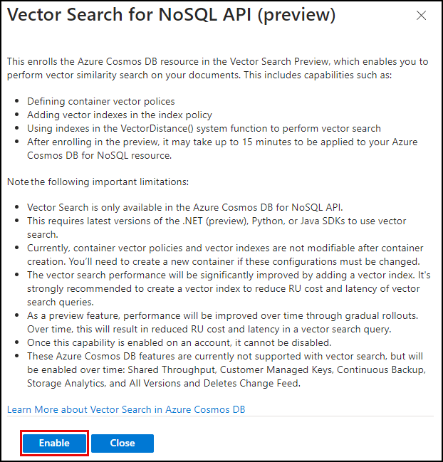

# Task 01 - Enable vector search in Azure Cosmos DB for NoSQL (10 minutes)

## Introduction

Vector search is a technique that allows items to be found based on their data characteristics instead of exact matches on a specific property field. Instead of requiring exact matches, vector search enables you to find items based on their vector representations. This technique is advantageous when performing similarity searches and is particularly valuable in applications that need to search for information within large blocks of text, such as Consoso Suites' applications.

The Azure Cosmos DB for NoSQL API includes a vector search feature that provides a robust method for managing and querying high-dimensional vectors. This capability is essential for AI-driven applications requiring an integrated vector search capability.

## Description

In this task, you will enable the Vector Search feature in your Azure Cosmos DB for NoSQL database, then define a container vector policy and specify an indexing policy on a Cosmos DB container you will create for storing property maintenance request data.

The key tasks are as follows:

1. Enable the Vector Search feature in Azure Cosmos DB for NoSQL.
2. Create a container named "MaintenanceRequests" in the `ContosoSuites` database, using the `hotel_id` field as the partition key.
3. During container creation, define a container vector policy using the `cosine` distance function and assign an appropriate vector index type. Designate the field for storing vector data as `request_vector`.

## Success Criteria

- You have enabled the Vector Search for NoSQL API feature in your Azure Cosmos DB instance.
- You have defined a vector policy for the `MaintenanceRequests` container in the `ContosoSuites` database in Azure Cosmos DB.
- You have specified an appropriate vector indexing policy on the container to improve similarity search efficiency.

## Learning Resources

- [What is vector search?](https://learn.microsoft.com/azure/cosmos-db/gen-ai/vector-search-overview)
- [What is a vector database?](https://learn.microsoft.com/azure/cosmos-db/vector-database)
- [Vector Search in Azure Cosmos DB for NoSQL](https://learn.microsoft.com/azure/cosmos-db/nosql/vector-search)
- [Vector indexes](https://learn.microsoft.com/azure/cosmos-db/index-policy#vector-indexes)
- [What are distance functions?](https://learn.microsoft.com/azure/cosmos-db/gen-ai/distance-functions)

## Solution

<details markdown="block">
<summary>Expand this section to view the solution</summary>

- Enabling the Vector Search for NoSQL API feature in Azure Cosmos DB can be done via the [Azure portal](https://portal.azure.com) or the Azure CLI. The steps for each technique are listed below. Note that enabling the feature may take several minutes to take effect.
  - The steps for enabling the feature in the Azure portal are as follows:
    1. Navigate to your Azure Cosmos DB for NoSQL resource in the [Azure portal](https://portal.azure.com).
    2. Expand the **Settings** item in the left-hand menu, select **Features**, and on the **Features** page, select **Vector Search for NoSQL API**.

        

    3. In the **Vector Search for NoSQL API** dialog, review the feature description and select **Enable**.

        

    4. Wait for the notification that the feature was successfully enabled. You should see the **Status** of the **Vector Search for NoSQL API** change to **On**.

  - To enable Vector Search via the Azure CLI:
    1. From the toolbar in the [Azure portal](https://portal.azure.com), open the Azure Cloud Shell.
    2. Ensure the cloud shell is using the subscription you are using for this exercise by running `az account set -s <YOUR_SUBSCRIPTION_ID>`, replacing the `<YOUR_SUBSCRIPTION_ID>` token with the id of the subscription you are using for this exercise.
    3. Execute the following command from the Azure Cloud Shell. Ensure you replace the `<resource-group-name>` and `<account-name>` tokens with the appropriate values from your deployed resource group.

        ```azurecli
        az cosmosdb update \
            --resource-group <resource-group-name> \
            --name <account-name> \
            --capabilities EnableNoSQLVectorSearch
        ```

    4. Wait for the command to run successfully before leaving the Azure Cloud Shell.

- Container vector policies and vector indexing policies must be defined at the time of container creation.
  - In the [Azure portal](https://portal.azure.com), navigate to your Cosmos DB resource.
  - Select **Data Explorer** in the left-hand menu.
  - On the **Data Explorer** page, select **New Container**
  - In the **New Container** dialog:
    - Select **Use existing** under **Database id** and select the **ContosoSuites** database from the dropdown list.
    - Enter "MaintenanceRequests" into the **Container id** box.
    - Enter "/hotel_id" into the **Partition key** box.
    - Expand the **Container Vectory Policy** section of the dialog, select **Add vector embedding**, and then enter the following values into the specified fields:
      - Path: Enter **"/request_vector"**.
      - Data type: Select **float32**.
      - Distance function: Select **cosine**.
      - Dimensions: Enter **1536**. This is based on the number of dimensions generated by the `ada-text-embedding-002` model in Azure OpenAI.
      - Index type: Select **diskANN**. Given the number of dimensions being specified, 1536, the `flat` index type will not work, as it only supports a maximum of 505 dimensions for vectors. The `quantizedFlat` index could also be used here. `diskANN` is a more efficient index type, but given the amount of data we are working with in this lab, you likely will not notice any difference in performance.
    - Select **OK** to create the container.

  {: .note }
  > If you receive an error message that "A Container Vector Policy has been provided, but the capability has not been enabled on your account," wait another 5-10 minutes before trying again.

</details>
