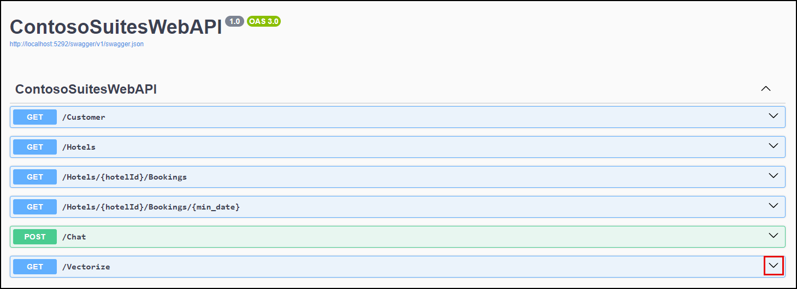
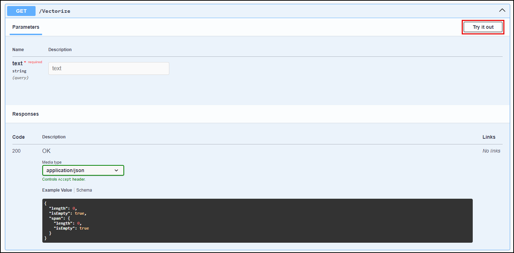
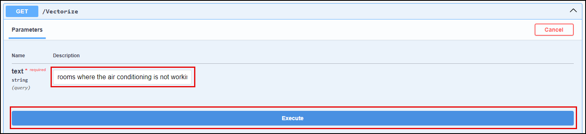
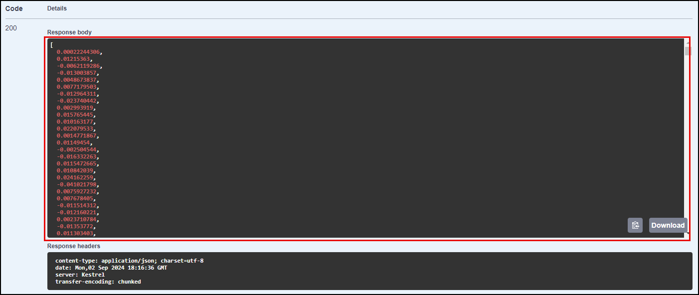
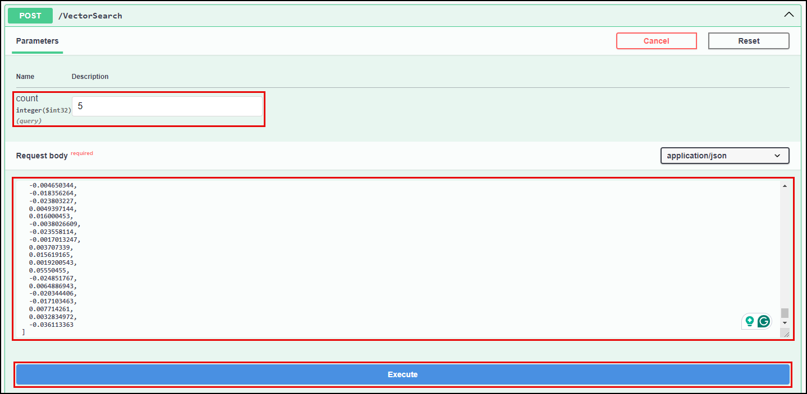

# Task 03 - Integrate vector search capabilities into the Contoso Suites CIS (30 minutes)

## Introduction

Implementing vector search capabilities in the Contoso Suites UI will allow customer service representatives to use natural language queries to find maintenance requests. This functionality relies on vector search's ability to find items based on data characteristics instead of exact matches on a specific property field. In the prior task, you vectorized maintenance request content that combined the hotel's name with the request details, allowing searching for requests at a specific hotel or across various properties.

## Description

In the previous task, you added vector embeddings to property maintenance request data stored in Azure Cosmos DB for NoSQL and then performed a vector search using query embeddings stored in a file. It is necessary to create embeddings for incoming query text to perform vector searches, so in this task, you will integrate vector search capabilities into the Contoso Suites Customer Information System (CIS) application, leveraging a vectorization API endpoint in the Contoso Suites Web API to create embeddings for the query being performed. The API will vectorize incoming questions from the UI, which can be used in queries executing the `VectorDistance()` function.

The key tasks are as follows:

1. Add a new .NET user secret called `CosmosDB:ConnectionString`. This value should be your Cosmos DB connection string. Add another user secret called `AzureOpenAI:EmbeddingDeploymentName`, which should take on a value of `text-embedding-ada-002`.
2. Generate query text embeddings using the `/Vectorize` endpoint of the ContosoSuitesWebAPI.
3. Provide a method named `ExecuteVectorSearch` in the `VectorizationService` for executing a vector search query against Azure Cosmos DB. The method should accept vectorized query text (called `queryVector`), the maximum number of results to return (named `max_results`), and the minimum similarity score (named `minimum_similarity_score`) and execute a query using the `VectorDistance()` function. It should return a list of `VectorSearchResult` objects. The count should limit the number of results returned. The query executed in Cosmos DB should use the following pattern:

    ```csharp
    var query = $"SELECT c.hotel_id AS HotelId, c.hotel AS Hotel, c.details AS Details, c.source AS Source, VectorDistance(c.request_vector, [{string.Join(",", queryVector)}]) AS SimilarityScore FROM c";
    query += $" WHERE VectorDistance(c.request_vector, [{string.Join(",", queryVector)}]) > {minimum_similarity_score}";
    query += $" ORDER BY VectorDistance(c.request_vector, [{string.Join(",", queryVector)}])";
    ```

4. Update the `/VectorSearch` route handler in the `Program.cs` file to call the `ExecuteVectorSearch` method on the `VectorizationService` and return the results.
5. Implement vector search capabilities to the UI and submit the following queries for maintenance requests:
   - Set the search query to "Show me rooms where the air conditioning unit is malfunctioning," enter ten as the max result count and select a minimum similarity score of 0.80.
   - Execute the same query a second time, this time setting the minimum similarity score to 0.82, and observe how that setting can be used to reduce the number of irrelevant results.
   - Search for "Rooms at the Oceanview Inn where there are air conditioning issues, " enter five as the maximum number of results to return and set the minimum similarity score slider to 0.85.
   - Finally, find fire safety requests using the search query, "Are there any requests about fire and safety equipment at any hotels?" Set the max results to 10.

## Success Criteria

- You have tested the `/Vectorize` endpoint of the ContosoSuitesWebAPI locally and used the generated vectors to execute similarity search queries in Azure Cosmos DB.
- You have updated the `VectorizationService` and its interface to include an `ExecuteVectorSearch(float[] queryVector, int count = 0)` method that returns `List<VectorSearchResult>>`.
- You have added a `/VectorSearch` endpoint to the API.
- You have tested the `/VectorSearch` endpoint using the Swagger UI by passing in vector embeddings generated by the `/Vectorize` endpoint.
- You have successfully added the ability to perform vector searches to the UI and submitted queries.

## Tips

- If the ContosoSuitesWebAPI .NET application build is failing when you try to run `dotnet run` and you receive an error that the build cannot load the required packages from NuGet, you may be missing a link to the Microsoft NuGet repository. Run the command `dotnet nuget list source` and see if you have an entry enabled for nuget.org. If not, add it with the following command: `dotnet nuget add source https://api.nuget.org/v3/index.json -n nuget.org`. If you have one but it is currently disabled, you can enable it with the command `dotnet nuget enable source nuget.org`.

## Learning Resources

- [Python requests](https://requests.readthedocs.io/en/latest/user/quickstart/#make-a-request)
- [Streamlit text input](https://docs.streamlit.io/develop/api-reference/widgets/st.text_input)
- [Streamlit table](https://docs.streamlit.io/develop/api-reference/data/st.table)
- [Route handlers in minimal APIs](https://learn.microsoft.com/aspnet/core/fundamentals/minimal-apis/route-handlers?view=aspnetcore-8.0)
- [Parameter binding in minimal APIs](https://learn.microsoft.com/aspnet/core/fundamentals/minimal-apis/parameter-binding?view=aspnetcore-8.0)

## Solution

<details markdown="block">
<summary>Expland this section to view the solution</summary>

- To add the user secrets, run the following command:

  ```sh
  dotnet user-secrets set "CosmosDB:ConnectionString" "{YOUR_CONNECTION_STRING}"
  dotnet user-secrets set "CosmosDB:DatabaseName" "ContosoSuites"
  dotnet user-secrets set "CosmosDB:MaintenanceRequestsContainerName" "MaintenanceRequests"
  dotnet user-secrets set "AzureOpenAI:EmbeddingDeploymentName" "text-embedding-ada-002"
  ```

- The steps to generate vector embeddings for query text using the ContosoSuitesWebAPI's `/Vectorize` endpoint are as follows:
  - In Visual Studio Code, open a new terminal window and change the directory to `src\ContotoSuitesWebAPI`.
  - At the terminal prompt, enter the following command to run the API locally:

    ```bash
    dotnet run
    ```

  - Once the API has started, as indicated by output in the terminal stating `Now listening on: http://localhost:5292`, open a web browser and navigate to the [Swagger UI page for the API](http://localhost:5292/swagger/).

    {: .note }
    > If you are using a GitHub Codespaces instance, open the website in a browser and navigate to the **/swagger** URL.

  - Expand the `/Vectorize` endpoint block on the Swagger UI page.

    

  - Within the `/Vectorize` block, select **Try it out**.

    

  - Enter the query "rooms where the air conditioning is not working" into the **text** box, then select **Execute**.

    

  - Observe the **Response body** returned. The response contains an array of floating point values representing the query text. This array contains 1536 dimensions.
  - Copy the entire response body, including the opening and closing square brackets.

    

  - In the [Azure portal](https://portal.azure.com), navigate to your Cosmos DB resource and select **Data Explorer** in the left-hand menu.
  - In the Data Explorer, expand the **ContosoSuites** database and the **MaintenanceRequests** container, then select **Items**.
  - On the toolbar, select **New SQL Query**.
  - In the new query window, paste in the following query:

    ```sql
    SELECT c.hotel, c.details, VectorDistance(c.request_vector, <QUERY_VECTOR>) AS SimilarityScore
    FROM c
    ```

  - Replace the `<QUERY_VECTOR>` token in the query with the vector output you copied from the API response body.
  - Select **Execute Query** on the toolbar and observe the output in the **Results** panel.
  - In Visual Studio Code, stop the API project by selecting the terminal window where it is running and pressing CTRL+C.

- To provide a method in the `VectorizationService` and an API endpoint for executing a vector search query against Azure Cosmos DB:
  - In Visual Studio Code, open the `IVectorizationService.cs` file in the `src\ContosoSuitesWebAPI` folder and complete `Exercise 3 Task 3 TODO #1` by uncommenting the interface definition for the `ExecuteVectorSearch` method.
  - Next, open the `VectorizationService.cs` file in the `src\ContosoSuitesWebAPI` folder and complete `Exercise 3 Task 3 TODO #2` by uncommenting the method definition for the `ExecuteVectorSearch` method.

- To complete the code for the exposing `/VectorSearch` endpoint on the API:
  - Open the `Program.cs` file in the `src\ContosoSuitesWebAPI` folder, locate the `app.MapPost("/VectorSearch"...)` route handler, and complete `Exercise 3 Task 3 TODO #3` by writing code to call the `ExecuteVectorSearch` method on the `VectorizationService` and returning the results. The body of the route handler should contain the following or similar code:

    ```csharp
    var results = await vectorizationService.ExecuteVectorSearch(queryVector, max_results, minimum_similarity_score);
    return results;
    ```

  - Return to the terminal prompt and enter the following command again to start the API locally:

    ```bash
    dotnet run
    ```

  - Once the API has started, test the `/VectorSearch` endpoint by opening a web browser and navigating to the [Swagger UI page for the API](http://localhost:5292/swagger/).
  - On the Swagger UI page, use the `/Vectorize` endpoint to generate embeddings for the query text "rooms where the air conditioning is not working", as you did previously.
  - Copy the entire response body, including the opening and closing square brackets.
  - Expand the `/VectorSearch` endpoint block and select **Try it out**.
  - Enter "5" into the `max_results` parameter box.
  - Enter "0.5" into the `minimum_similarity_score` parameter box.
  - Paste the vector embeddings you copied from the output of the `/Vectorize` endpoint into the `Request body` block, and select **Execute**.

    

  - Ensure the response body contains a collection of `VectorSearchResult` objects. The output should look similar to the following:

    ```json
    [
      {
        "hotelId": 13,
        "hotel": "Seaside Luxury Resort",
        "details": "Guest in room 220 reported that the air conditioning is not cooling properly.",
        "source": "customer",
        "similarityScore": 0.8718685
      },
      {
        "hotelId": 1,
        "hotel": "Oceanview Inn",
        "details": "The air conditioning (A/C) unit in room 105 is malfunctioning and making a loud noise. This needs maintenance attention.",
        "source": "staff",
        "similarityScore": 0.8505241
      },
      {
        "hotelId": 1,
        "hotel": "Oceanview Inn",
        "details": "The air conditioning (A/C) unit in room 227 is malfunctioning and making a loud noise. Customer will be out of the room between 5:00 and 8:30 PM this evening. This needs immediate maintenance attention. If the issue cannot be resolved, we will need to move the customer to a new room.",
        "source": "customer",
        "similarityScore": 0.8503952
      },
      {
        "hotelId": 13,
        "hotel": "Seaside Luxury Resort",
        "details": "Reported issue with the thermostat in room 110. Maintenance needs to check the HVAC system.",
        "source": "staff",
        "similarityScore": 0.8419426
      },
      {
        "hotelId": 1,
        "hotel": "Oceanview Inn",
        "details": "Reported issue with the thermostat in room 210. Maintenance needs to check the HVAC system.",
        "source": "staff",
        "similarityScore": 0.8410596
      }
    ]
    ```

  - Leave the Web API running for the next step.

- To add vector search capabilities to the UI, open the file `src\ContosoSuitesDashboard\pages\3_Vector_Search.py`. The code will run as-is, but will not have knowledge of how to vectorize query text or perform vector searches. To support vector search capabilities, make the following changes to the Python script.
  - In the `if query:` block of the Submit button code in the `main()` function:
    - Vectorize the search query text by completing `Exercise 3 Task 3 TODO #4`. Send the search query text to the `handle_query_vectorization()` method and set the results to a variable.
    - Perform a vector search by completing `Exercise 3 Task 3 TODO #5`. Pass the vectorized search query, along with the desired number of results, to the `handle_vector_search()` function.
    - Display the results in a table by completing `Exercise 3 Task 3 TODO #6`. Use the `st.table()` method and provide the JSON value from the search results.
    - The completed code for the `if st.button("Submit")` block should look like the following:

      ```python
      if st.button("Submit"):
        with st.spinner("Performing vector search..."):
            if query:
                # Vectorize the query text.
                # Exercise 3 Task 3 TODO #4: Get the vectorized query text by calling handle_query_vectorization.
                query_vector = handle_query_vectorization(query)
                # Perform the vector search.
                # Exercise 3 Task 3 TODO #5: Get the vector search results by calling handle_vector_search.
                vector_search_results = handle_vector_search(query_vector, max_results, minimum_similarity_score)
                # Display the results.
                st.write("## Results")
                # Exercise 3 Task 3 TODO #6: Display the results as a table.
                st.table(vector_search_results.json())
            else:
                st.warning("Please enter a query.")
      ```

      {: .note }
      > Python code is sensitive to indentation and formatting, so pay close attention to indentation if copying and pasting the above code into the `3_Vector_Search.py` file.

  - Test your completed code by opening a new terminal window in Visual Studio Code, navigating to the `src\ContosoSuitesDashboard` folder, and running the following command to start the Streamlit dashboard:

    ```bash
    python -m streamlit run Index.py
    ```

- Navigate to the **Vector Search** page using the left-hand menu in the browser windows that opens, and then submit the following queries for maintenance requests and observe the results:
  - Set the search query to "Show me rooms where the air conditioning unit is malfunctioning," enter ten as the max result count and select a minimum similarity score of 0.80.
  - Execute the same query a second time, this time setting the minimum similarity score to 0.82, and observe how that setting can be used to reduce the number of irrelevant results.
  - Search for "Rooms at the Oceanview Inn where there are air conditioning issues, " enter five as the maximum number of results to return and set the minimum similarity score slider to 0.85.
  - Find fire safety requests using the search query, "Are there any requests about fire and safety equipment at any hotels?" Set the max results to 10.

</details>
