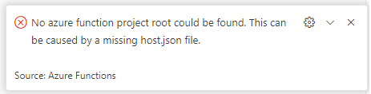
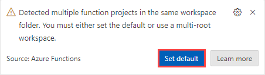
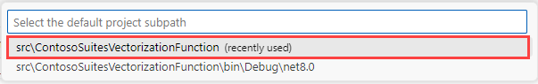
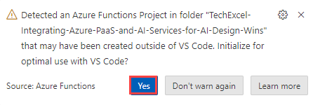
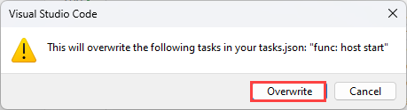
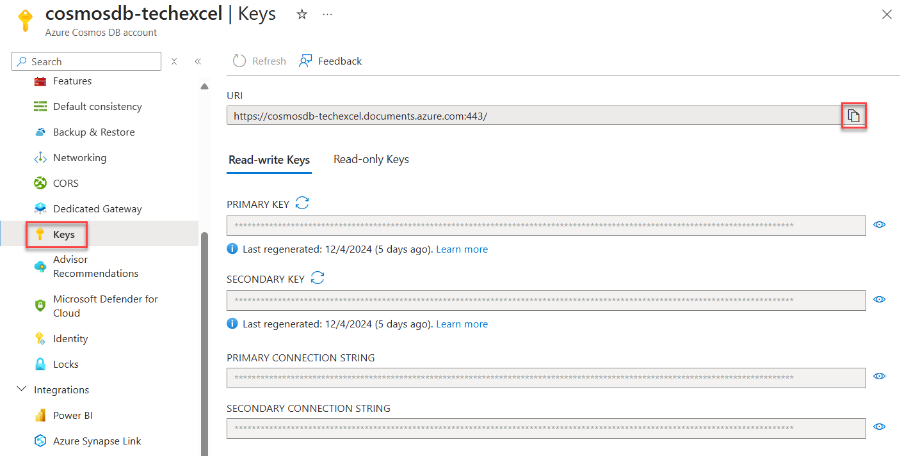
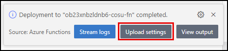
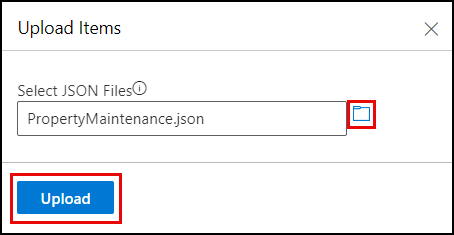
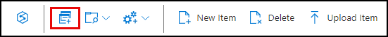

# Task 02 - Create and store vector embeddings (45 minutes)

## Introduction

Vectors, also known as embeddings or vector embeddings, are mathematical representations of data in a high-dimensional space. Each dimension corresponds to a feature of the data in this space, and tens of thousands of dimensions might be used to represent sophisticated data. A vector's position in this space represents its characteristics. Words, phrases, or entire documents, as well as images, audio, and other types of data, can all be vectorized. An embedding is a data representation format that machine learning models and algorithms can efficiently utilize. The embedding is an information-dense representation of the semantic meaning of a piece of text. Each embedding is a vector of floating point numbers. Hence, the distance between two embeddings in the vector space correlates with the semantic similarity between two inputs in the original format. Azure OpenAI provides several models for creating vector embeddings, and for this exercise, you will use the `text-embedding-ada-002` model.

You will use a vector database to store the generated embeddings. Vector databases are designed to store and manage vector embeddings. The vector database you will use is Azure Cosmos DB for NoSQL. It allows you to store vectors alongside traditional schema-free data within your documents, streamlining data management and significantly enhancing the efficiency of vector operations. Keeping all relevant data in a single logical unit simplifies your data architecture, making it easy to understand and manage.

## Description

You configured Azure Cosmos DB for NoSQL as an integrated vector database in the prior task. In this task, you will use an Azure Function, Azure OpenAI, and the Azure Cosmos DB change feed to generate vector embeddings for property maintenance requests and save those into the `MaintenanceRequests` container in Cosmos DB.

You will conclude by uploading data supplied by the Contoso Suites staff into the `MaintenanceRequests` container you created in Cosmos DB and allowing the deployed function app to generate vectors for each record. The JSON data files provided by Contoso Suites contain maintenance requests for several hotels on their resorts. They offer an example of the types of data the company believes can benefit from the similarity search capabilities provided by Vector Search in Cosmos DB for NoSQL, so they would like you to incorporate this data into the proof of concept.

## Success Criteria

- You have tested the function locally.
- You have deployed the function to your Azure Function app.
- You have successfully created vector embeddings for each document in the `PropertyMaintenance.json` file using the deployed Function App and written them into Azure Cosmos DB.
- You have executed a `VectorDistance()` function via the Cosmos DB Data Explorer.

## Learning Resources

- [What are vector embeddings?](https://learn.microsoft.com/azure/cosmos-db/gen-ai/vector-embeddings)
- [Understand embeddings in Azure OpenAI service](https://learn.microsoft.com/azure/ai-services/openai/concepts/understand-embeddings)
- [Azure OpenAI embeddings models](https://learn.microsoft.com/azure/ai-services/openai/concepts/models#embeddings-models)
- [Learn how to generate embeddings with Azure OpenAI](https://learn.microsoft.com/azure/ai-services/openai/how-to/embeddings?tabs=csharp)
- [VectorDistance (NoSQL query)](https://learn.microsoft.com/azure/cosmos-db/nosql/query/vectordistance)
- [OpenAI Inference](https://learn.microsoft.com/dotnet/api/overview/azure/ai.openai-readme?view=azure-dotnet-preview)
- [AzureOpenAIClient class](https://learn.microsoft.com/dotnet/api/azure.ai.openai.azureopenaiclient?view=azure-dotnet-preview)
- [Serverless event-based architectures with Azure Cosmos DB and Azure Functions](https://learn.microsoft.com/azure/cosmos-db/nosql/change-feed-functions)
- [Connect Azure Functions to Azure Cosmos DB using Visual Studio Code](https://learn.microsoft.com/azure/azure-functions/functions-add-output-binding-cosmos-db-vs-code?pivots=programming-language-csharp)
- [Azure Cosmos DB output binding for Azure Functions](https://learn.microsoft.com/azure/azure-functions/functions-bindings-cosmosdb-v2-output?tabs=python-v2%2Cisolated-process%2Cnodejs-v4%2Cextensionv4&pivots=programming-language-csharp)

## Tips

1. You may get the following error when trying to deploy the Azure Function:

    

    If you get this error message, you must set the default Azure Functions project in the workspace folder. Close and re-open Visual Studio Code, and you should see a warning message that you have multiple function projects in the same workspace folder.

    

    After selecting the **Set Default** button, you will receive a prompt to choose a default project subpath. Choose the `src\ContosoSuites\VectorizationFunction` option.

    

    You may receive a warning message asking if you wish to initialize this function for optimal use with Visual Studio Code. Select **Yes** to do this.

    

    You will receive a warning modal that this operation will overwrite your task.json. Select **Overwrite** to complete this task.

    

2. If you receive authentication errors for Cosmos DB when running the Azure Function locally, it may be that internal policies have disabled key-based authentication. To fix this:

    Navigate to the `src\InfrastructureAsCode` folder to Visual Studio Code and right-click the `DeployAzureResources.bicep` file. Then, select **Deploy Bicep File...** in the context menu. This will update your Azure Cosmos DB instance to re-enable key-based authentication.

    {: .note }
    > The update may take up to 10 minutes before you see the change apply.

## Key Tasks

### 01: Review Azure function code

Review the Azure Function code in the `CosmosChangeFeedVectorization.cs` file in the `src\ContosoSuitesVectorizationFunction` folder. The function:

1. Is triggered whenever a document is inserted or updated in the `MaintenanceRequests` container using the Azure Cosmos DB change feed.
2. Combines the contents of a maintenance request's `hotel` and `details` fields and vectorizes the resulting text using a `text-embedding-ada-002` model in Azure OpenAI.
3. Writes generated vectors into the `request_embeddings` fields of the document and updates it in the `MaintenanceRequests` container.
4. Marks the document as "Vectorized."

<details markdown="block">
<summary><strong>Expand this section to view the solution</strong></summary>

The steps to review the function app are as follows:

1. Open the `CosmosChangeFeedVectorization.cs` file in the `src\ContosoSuitesVectorizationFunction` folder.
2. The `DatabaseName` and `ContainerName` constants defined on lines 16 and 17 refer to the Azure Cosmos DB database created by the Bicep script and the container you created in task 1 of this exercise, respectively. If those values differ in your environment, the values assigned to the constants must be updated to reflect what is in your environment.
3. Locate the `Run` function starting on line 42 and examine the code contained within it.
   1. The code on line 49 reduces the list of documents sent to the function to only those that do not have a `Type` of "Vectorized". This prevents the updates pushed by the function back to the `MaintenanceRequests` container from being revectorized by the function.
   2. If no documents require vectorization, the function will exit without making any changes to the input documents.
   3. The `foreach` loop starting on line 52 iterates through each document in the change feed that requires vectorization. The `hotel` and `details` fields are combined, and the text is sent to Azure OpenAI to create vector embeddings using the deployment for the `text-embedding-ada-002` model. The returned vector embeddings are saved into the `RequestVector` field of the document.
   4. The document's `Type` field is "Vectorized."
   5. On line 74, the list of input documents is returned, which uses the Cosmos DB output binding to write the documents updated with vector embeddings back into the `MaintenanceRequests` container in Cosmos DB.

</details>

### 02: Create settings file

Create a `local.settings.json` file in the `src\ContosoSuitesVectorizationFunction` folder and populate it with the settings the function needs to run the function locally. Hint: the required values can be identified using the calls to `Environment.GetEnvironmentVariable` in the `CosmosChangeFeedVectorization.cs` file, as well as providing the Cosmos DB connection string required by the input and output bindings of the function.

<details markdown="block">
<summary><strong>Expand this section to view the solution</strong></summary>

To create a `local.settings.json` file, navigate to the `src\ContosoSuitesVectorizationFunction` directory, create a new file named `local.settings.json`, and add the following content, replacing the bracketed tokens with values from your Azure OpenAI and Azure Cosmos DB services.

```json
{
  "IsEncrypted": false,
  "Values": {
    "AzureWebJobsStorage": "",
    "FUNCTIONS_WORKER_RUNTIME": "dotnet-isolated",
    "AzureOpenAIEndpoint": "[YOUR_AZURE_OPENAI_ENDPOINT]",
    "AzureOpenAIKey": "[YOUR_AZURE_OPENAI_KEY]",
    "CosmosDBConnectionString": "[YOUR_COSMOS_DB_CONNECTION_STRING]",
    "EmbeddingDeploymentName": "text-embedding-ada-002"
  }
}
```

To retrieve the required Azure OpenAI and Cosmos DB values:

1. Open the [Azure portal](https://portal.azure.com/) in a web browser and navigate to the resource group you created.
2. Select the Azure OpenAI service in the resource group.
   1. Under the **Resource Management** menu, select **Keys and Endpoint**.
   2. Copy the value of **KEY 1** and paste it into the `AzureOpenAIKey` value of the `local.settings.json` file.
   3. Copy the value of **Endpoint** and paste it into the `AzureOpenAIEndpoint` value.

    

3. Return to your resource group and select the Azure Cosmos DB resource.
   1. Under the **Settings** menu, select **Keys**, then show and copy the **PRIMARY CONNECTION STRING** value and paste it as the `CosmosDBConnectionString` value in the `local.settings.json` file.

   

4. The `EmbeddingDeploymentName` value is preset, based on the deployment created by the Bicep script for the `text-embedding-ada-002` model. If that value differs in your environment, you must update this setting accordingly.

</details>

### 03: Test the function

Test the function locally and evaluate the inputs and outputs of the function.

1. Use breakpoints in the function's `Run` method to examine the input collection and processing as a new record is added.
2. After starting a local debug session, insert the following document into the `MaintenanceRequests` container and observe the function execution results as your breakpoints are hit.

   ```json
   {
     "hotel_id": 1, 
     "hotel": "Oceanview Inn",
     "source": "customer",
     "date": "2024-08-10",
     "details": "The air conditioning (A/C) unit in room 227 is malfunctioning and making a loud noise. Customer will be out of the room between 5:00 and 8:30 PM this evening. This needs immediate maintenance attention. If the issue cannot be resolved, we will need to move the customer to a new room.",
     "room_number": 227
   }
   ```

3. Once the function execution is complete, examine the document in Cosmos DB and inspect the vector embeddings inserted into the `request_vector` field of the document.

<details markdown="block">
<summary><strong>Expand this section to view the solution</strong></summary>

To test the function locally:

1. Open a new terminal window in Visual Studio Code and change the path to the `src\ContosoSuitesVectorizationFunction` folder.
2. Open the `CosmosChangeFeedVectorization.cs` file in the `src\ContosoSuitesVectorizationFunction` folder.
3. Set a breakpoint on line 50 so you can examine the values of the `documentsToVectorize`, `task.RequestVector`, and `input` as you step through the function.
4. Select **F5** on your keyboard to start a debug session in Visual Studio Code. In the terminal window created, wait until the function has started.
5. In a browser window, open the [Azure portal](https://portal.azure.com/) and navigate to your Cosmos DB account.
6. On the Azure Cosmos DB account page, select **Data Explorer** from the left-hand menu, expand the **ContosoSuites** database and the **MaintenanceRequests** container, and select **Items** under the container.
7. Select **New item** on the toolbar, then paste the following document into the window that appears.

    ```json
    {
      "hotel_id": 1, 
      "hotel": "Oceanview Inn",
      "source": "customer",
      "date": "2024-08-10",
      "details": "The air conditioning (A/C) unit in room 227 is malfunctioning and making a loud noise. Customer will be out of the room between 5:00 and 8:30 PM this evening. This needs immediate maintenance attention. If the issue cannot be resolved, we will need to move the customer to a new room.",
      "room_number": 227
    }
    ```

8. Select **Save** on the toolbar to insert the document into the `MaintenanceRequests` container:
9. Return to Visual Studio Code and wait for your breakpoint to be hit.
10. Observe the values of the `documentsToVectorize`, `task.RequestVector`, and `input` variables as you step through the code (F11), allowing the function to run completely.
11. Return to the Cosmos DB **Data Explorer** in the Azure portal and select the document that was inserted into the `MaintenanceRequests` container. Inspect the `request_vector` property to review the structure of the generated vector embeddings. Also, note the `type` field has been set to "Vectorized."
12. Return to Visual Studio Code and select "Shift+F5" on the keyboard to stop the function app debug session.

</details>

### 04: Deploy the function app

Use VS Code to deploy the function to the Azure Function App in your resource group and add the required app configuration settings.

<details markdown="block">
<summary><strong>Expand this section to view the solution</strong></summary>

The steps to deploy the function to Azure are as follows:

1. In Visual Studio Code, open a new terminal window and change the directory to the `src\ContosoSuitesVectorizationFunction` project folder.
2. At the terminal prompt, execute the following command to build a release version of the function:

    ```bash
    dotnet build --configuration Release
    dotnet publish
    ```

3. In the explorer pane in Visual Studio Code, navigate to the `src\ContosoSuitesVectorizationFunction\bin\Release\net8.0` folder, then right-click on the `publish` folder, and in the context menu, select **Deploy to Function App**.
4. In the **Select Function App** command pallet dialog that appears at the top of Visual Studio Code:
   1. Select the subscription you are using for this exercise.
   2. Choose the function app in your resource group.
5. Select **Deploy** in the Visual Studio Code dialog asking about deploying and overwriting previous deployments.
6. Use the **Output** window at the bottom of Visual Studio Code to monitor the deployment.
7. When the deployment is complete, you will get a notification in the bottom right-hand corner of Visual Studio Code. In this notification window, select **Upload settings**. This will upload the values from the `local.settings.json` file into environment variables in your function app.

    

</details>

### 05: Check environment variables

Confirm the settings were uploaded correctly by navigating to the **Settings** menu of your function app in the [Azure portal](https://portal.azure.com/) and selecting **Environment variables**. Along with other settings added by the Bicep script and deployment process, you should see the following settings:

- `AzureOpenAIEndpoint`
- `AzureOpenAIKey`
- `CosmosDBConnectionString`
- `EmbeddingDeploymentName`

{: .note }
> If you do not see these settings, add them using the App settings tab's **+ Add** button.

### 06: Verify function behavior

Verify that the deployed function is working correctly by inserting the following record into the `MaintenanceRequests` container in Cosmos DB. Then, use the Log Stream for the Function App to observe the output.

```json
{
  "hotel_id": 12, 
  "hotel": "The Downtown Plaza Hotel",
  "source": "customer",
  "date": "2024-08-11",
  "details": "The thermostat does not appear to be working in room 328, and the air conditioning (A/C) unit will not turn on to cool down the room.",
  "room_number": 328
}
```

<details markdown="block">
<summary><strong>Expand this section to view the solution</strong></summary>

To verify the function app was deployed successfully and is working correctly:

1. Open the Log Stream for the Function App by selecting **Log Stream** under **Monitoring** in the left-hand menu of the Function App page in the [Azure portal](https://portal.azure.com/).
2. Open a new browser window or tab, navigate to the `MaintenanceRequests` container in your Cosmos DB account, and select `Items`.
3. Insert the following record into the `MaintenanceRequests` container in Cosmos DB.

    ```json
    {
      "hotel_id": 12, 
      "hotel": "The Downtown Plaza Hotel",
      "source": "customer",
      "date": "2024-08-11",
      "details": "The thermostat does not appear to be working in room 328, and the air conditioning (A/C) unit will not turn on to cool down the room.",
      "room_number": 328
    }
    ```

4. Return to the Function Apps **Log Stream** browser window and observe the logs to ensure you see the function execute and verify that it generated vector embeddings for the maintenance request.
5. Return to the Cosmos DB `MaintenanceRequests` browser window and select the request item that was just inserted to ensure it refreshes and contains a `request_vector` value.

</details>

### 07: Populate maintenance requests container

Populate the `MaintenanceRequests` container with data from the `PropertyMaintenance.json` file in the [src\data folder](https://github.com/microsoft/TechExcel-Integrating-Azure-PaaS-and-AI-Services-for-AI-Design-Wins/tree/main/src/data) of the repository.

<details markdown="block">
<summary><strong>Expand this section to view the solution</strong></summary>

Use the Data Explorer to populate the `MaintenanceRequests` container with data from the `PropertyMaintenance.json` file provided by Contoso Suites.

1. In the [Azure portal](https://portal.azure.com), navigate to your Cosmos DB resource and select **Data Explorer** in the left-hand menu.
2. In the Data Explorer, expand the **ContosoSuites** database and the **MaintenanceRequests** container, then select **Items**.

    

3. Select **Upload Item** on the toolbar.

    

4. In the **Upload Items** dialog, select the browse button and navigate to the `PropertyMaintenance.json` file in the `src\data` directory in the location where cloned the repository, then select **Upload** to import the data in the file.

    

    {: .note }
    > If you are using a GitHub Codespaces instance, you can right-click on the `PropertyMaintenance.json` file and select **Download** to save a local copy of this file.

    The upload status should indicate 48 documents created.

5. Return to the Function Apps **Log Stream** browser window you opened in the previous step and observe the logs as the maintenance requests are uploaded and processed in bulk.
6. Return to the Cosmos DB `MaintenanceRequests` browser window, close the upload dialog, and select the refresh icon on the MaintenanceRequests>Items tab in the Data Explorer.

    

7. Select a few random request items to ensure they contain a `request_vector` value and have a `type` of "Vectorized."

</details>

### 08: Review results

1. Observe the files being processed in the Log Stream and review documents in the Cosmos DB Data Explorer to confirm the function correctly populated the `request_vector` field for newly added documents.
2. Execute a query to find documents similar to "air conditioning malfunction" using the `VectorDistance()` function via Cosmos DB Data Explorer. You can find the vector embeddings for "air conditioning malfunction" in the `Query_Vector.txt` file in the [src\data folder](https://github.com/microsoft/TechExcel-Integrating-Azure-PaaS-and-AI-Services-for-AI-Design-Wins/tree/main/src/data).

<details markdown="block">
<summary><strong>Expand this section to view the solution</strong></summary>

To execute a query using the `VectorDistance()` function for "air conditioning malfunction":

1. In the [Azure portal](https://portal.azure.com), navigate to your Cosmos DB resource and select **Data Explorer** in the left-hand menu.
2. In the Data Explorer, expand the **ContosoSuites** database and the **MaintenanceRequests** container, then select **Items**.
3. On the toolbar, select **New SQL Query**.

    

4. In the new query window, paste in the following query:

    ```sql
    SELECT c.hotel_id, c.hotel, c.details, VectorDistance(c.request_vector, <QUERY_VECTOR>) AS SimilarityScore
    FROM c
    ```

5. Replace the `<QUERY_VECTOR>` token in the query with the vectorized representation of "air conditioning malfunction," which you can find in the `Query_Vector.txt` file in the [src\data folder](https://github.com/microsoft/TechExcel-Integrating-Azure-PaaS-and-AI-Services-for-AI-Design-Wins/tree/main/src/data). Copy the entire contents of the file, and paste it into the query in place of `<QUERY_VECTOR>`.
6. Select **Execute Query** on the toolbar and observe the output in the **Results** panel. You should see a list of results similar to the following (abbreviated for brevity):

    ```json
    {
        "hotel_id": 1,
        "hotel": "Oceanview Inn",
        "details": "The air conditioning (A/C) unit in room 227 is malfunctioning and making a loud noise. Customer will be out of the room between 5:00 and 8:30 PM this evening. This needs immediate maintenance attention. If the issue cannot be resolved, we will need to move the customer to a new room.",
        "SimilarityScore": 0.847799148429741
    },
    {
        "hotel_id": 12,
        "hotel": "The Downtown Plaza Hotel",
        "details": "The thermostat does not appear to be working in room 328, and the air conditioning (A/C) unit will not turn on to cool down the room.",
        "SimilarityScore": 0.838297398035295
    }
    ```

</details>
