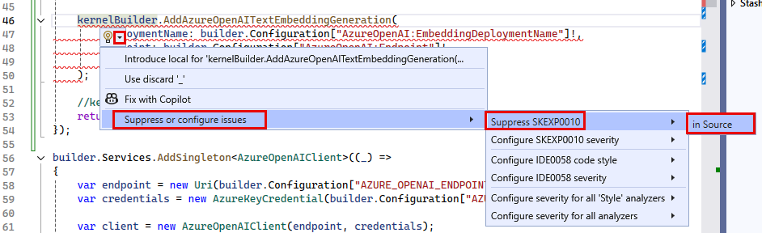

# Task 01 - Use the built-in embedding service of Semantic Kernel to perform vector embedding (20 minutes)

## Introduction

One of the primary features of Semantic Kernel is its ability to add different AI services to the kernel. It includes several built-in services from the Azure Open AI service, significantly simplifying interactions with the Azure OpenAI service from your applications. The Text Embedding Generator service can create vector embeddings like those generated to vectorize search queries when performing vector searches against data in Cosmos DB. Instead of rolling your own embedding functionality, you can make use of Semantic Kernel's embedding capabilities. This reduces the level of development effort and also reduces the risk of introducing a bug via custom code.

## Description

In exercise 3, you used the Azure OpenAI SDK to create a client capable of generating embeddings. In this task, you will update the `VectorizationService` and its `GetEmbeddings` function to take advantage of the built-in embedding service offered by Semantic Kernel. You will update the code in that service to replace the `AzureOpenAIClient` and its associated calls with a `Kernel` service to perform text embedding.

## Success Criteria

- You have added the Azure OpenAI Text Embedding Generation service to the Kernel builder in the `Program.cs` file.
- You have updated the `VectorizationService` and its `GetEmbeddings` method to use the built-in text embedding generation service to create vector embeddings for query text.
- You have successfully executed a query against the web API's `Vectorize` and `/VectorSearch` endpoints using the Streamlit dashboard's **Vector Search** page.

## Learning Resources

- [Introduction to Semantic Kernel](https://learn.microsoft.com/semantic-kernel/overview/)
- [Understanding the kernel](https://learn.microsoft.com/semantic-kernel/concepts/kernel?pivots=programming-language-csharp)
- [Adding AI services to Semantic Kernel](https://learn.microsoft.com/semantic-kernel/concepts/ai-services/)
- [OpenAIServiceCollectionExtensions.AddAzureOpenAITextEmbeddingGeneration Method](https://learn.microsoft.com/dotnet/api/microsoft.semantickernel.openaiservicecollectionextensions.addazureopenaitextembeddinggeneration?view=semantic-kernel-dotnet)
- [Semantic Kernel GitHub repo](https://github.com/microsoft/semantic-kernel)

## Tips

1. If you receive authentication errors for Cosmos DB when running your Web API project, it may be that internal policies have disabled key-based authentication. To fix this:

    Navigate to the `src\InfrastructureAsCode` folder to Visual Studio Code and right-click the `DeployAzureResources.bicep` file. Then, select **Deploy Bicep File...** in the context menu. This will update your Azure Cosmos DB instance to re-enable key-based authentication.

    {: .note }
    > The update may take up to 10 minutes before you see the change apply.

## Key Tasks

### 01: add the Text Embedding Generation service

Add the Text Embedding Generation built-in service to the Kernel builder in the `Program.cs` file. Suppress any warnings using `# pragma` directives.

<details markdown="block">
<summary><strong>Expand this section to view the solution</strong></summary>

Update the `Program.cs` file to add the built-in `TextEmbeddingGeneration` service:

1. Add `AddAzureOpenAITextEmbeddingGeneration(embeddingDeploymentName, endpoint, key)` to the `Kernel` singleton builder call added in Exercise 2 Task 2 (line 224 of the 0202.MD file).

    ```csharp
    kernelBuilder.AddAzureOpenAITextEmbeddingGeneration(
        deploymentName: builder.Configuration["AzureOpenAI:EmbeddingDeploymentName"]!,
        endpoint: builder.Configuration["AzureOpenAI:Endpoint"]!,
        apiKey: builder.Configuration["AzureOpenAI:ApiKey"]!
    );
    ```

    The code will be underlined by a red squiggly line, indicating an issue.

    The `AddAzureOpenAITextEmbeddingGeneration` feature of Semantic Kernel is flagged for evaluation purposes only at this time, so you must suppress that issue to be able to use it in the project.
2. To suppress the issue, hover your mouse cursor over the `AddAzureOpenAITextEmbeddingGeneration` function call and select the dropdown in the tooltip icon that appears.
    1. In the flyout menu, select **Suppress of configure issues -> Suppress SKEXP0010** and then select **in Source**.

        

    2. This will wrap the code in `#pragma warning disable` and `#pragma warning restore` directives, and the final code will look like this:

      ```csharp
      #pragma warning disable SKEXP0010 // Type is for evaluation purposes only and is subject to change or removal in future updates. Suppress this diagnostic to proceed.
          kernelBuilder.AddAzureOpenAITextEmbeddingGeneration(
              deploymentName: builder.Configuration["AzureOpenAI:EmbeddingDeploymentName"]!,
              endpoint: builder.Configuration["AzureOpenAI:Endpoint"]!,
              apiKey: builder.Configuration["AzureOpenAI:ApiKey"]!
          );
      #pragma warning restore SKEXP0010 // Type is for evaluation purposes only and is subject to change or removal in future updates. Suppress this diagnostic to proceed.
      ```

</details>

### 02: Remove AzureOpenAIClient service

Remove the `AzureOpenAIClient` singleton service from `Program.cs`, as it will no longer be necessary.

<details markdown="block">
<summary><strong>Expand this section to view the solution</strong></summary>

To remove the `AzureOpenAIClient` singleton service from `Program.cs`, locate the line that starts with `builder.Services.AddSingleton<AzureOpenAIClient>` and delete that line and the code block it encapsulates.

</details>

### 03: Update the vectorization service

Update the `VectorizationService` primary constructor to remove the `AzureOpenAIClient` and inject the `Kernel` service.

<details markdown="block">
<summary><strong>Expand this section to view the solution</strong></summary>

To update the `VectorizationService` primary constructor to remove the `AzureOpenAIClient` and inject the `Kernel` service, perform the following steps:

1. Remove the `Azure.AI.OpenAI` using statement.
2. Add the following Semantic Kernel references:

    ```csharp
    using Microsoft.SemanticKernel;
    using Microsoft.SemanticKernel.Embeddings;
    ```

3. Change the primary constructor for the `VectorizationService` to swap out the use of `AzureOpenAIClient` for Semantic Kernel, deleting the injected `AzureOpenAIClient` and replacing it with `Kernel`. The new primary constructor for the class will look like:

    ```csharp
    public class VectorizationService(Kernel kernel, CosmosClient cosmosClient, IConfiguration configuration) : IVectorizationService
    ```

4. Delete the `_client` class variable and create a new one named `_kernel` with a type of `Kernel`.

    ```csharp
    private readonly Kernel _kernel = kernel;
    ```

</details>

### 04: Update the GetEmbeddings method

Change the `GetEmbeddings` method to use the built-in vector embedding capabilities of Semantic Kernel.

<details markdown="block">
<summary><strong>Expand this section to view the solution</strong></summary>

The steps to update the `VectorizationService` to use the built-in vector embedding capabilities of Semantic Kernel are:

1. In the `GetEmbeddings` function, remove the `embeddingClient` variable, as it is no longer necessary.
2. Replace the call to the embedding client for the built-in `GenerateEmbeddingAsync()` method of Semantic Kernel.

    ```csharp
    // Generate a vector for the provided text.
    var embeddings = await _kernel.GetRequiredService<ITextEmbeddingGenerationService>().GenerateEmbeddingAsync(text);
    ```

3. As you did in the `Program.cs` class, you must suppress the issue with the `ITextEmbeddingGenerationService` feature using `# pragma warning` directives to use it in this class. The final code will look similar to the following:

    ```csharp
    #pragma warning disable SKEXP0001 // Type is for evaluation purposes only and is subject to change or removal in future updates. Suppress this diagnostic to proceed.
    // Generate a vector for the provided text.
    var embeddings = await _kernel.GetRequiredService<ITextEmbeddingGenerationService>().GenerateEmbeddingAsync(text);
    #pragma warning restore SKEXP0001
    ```

4. Update the `vector` variable to handle the different type returned by the `GenerateEmbeddingsAsync` method.

    ```csharp
    var vector = embeddings.ToArray();
    ```

5. Save the `VectorizationService` file.

</details>

### 05: Test the service

Test the updated `VectorizationService` by running the Streamlit dashboard and executing the following maintenance request query on the **Vector Search** page. Enter a search query of "Show me requests relating to elevator noises" with max results of ten and a minimum similarity score of 0.78.

<details markdown="block">
<summary><strong>Expand this section to view the solution</strong></summary>

1. To test the updated `VectorizationService`, start the web API and run the Steamlit dashboard.
   1. In Visual Studio Code, open a new terminal window and change the directory to `scr\ContotoSuitesWebAPI`.
   2. At the terminal prompt, enter the following command to run the API locally:

        ```bash
        dotnet run
        ```

2. Once the API has started, as indicated by output in the terminal stating `Now listening on: http://localhost:5292`, open a new terminal window in Visual Studio Code, navigate to the `src\ContosoSuitesDashboard` folder, and run the following command to start the Streamlit dashboard:

    ```python
    python -m streamlit run Index.py
    ```

3. Navigate to the **Vector Search** page in the Streamlit dashboard, and then submit the following query for maintenance requests:
   1. Enter a search query of "Show me requests relating to elevator noises" with max results of ten and a minimum similarity score of 0.78.
   2. You should see several results about elevators and noise, indicating the updates to the API and `VectorizationService` are working correctly.

</details>
