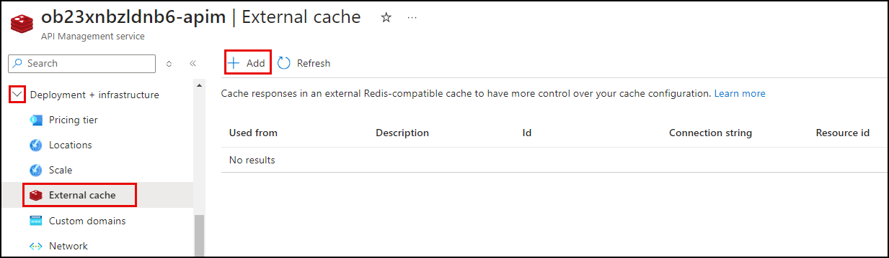

# Task 02 - Enable semantic caching for Azure OpenAI APIs (25 minutes)

## Introduction

By enabling semantic caching of responses to Azure OpenAI API requests, you can reduce bandwidth and processing requirements imposed on the backend APIs and lower the latency perceived by API consumers. With semantic caching, you can return cached responses for identical prompts and prompts that are similar in meaning, even if the text isn't the same.

## Description

In this task, you enable semantic caching for your Azure OpenAI API to generate LLM responses to queries and cache those responses using Azure Cache for Redis, delivering faster responses and lowering costs. Using its built-in vector search capability, you will also perform semantic caching and evaluate the performance benefits of returning cached responses for queries.

The essential tasks are as follows:

1. Add your Azure Cache for Redis Enterprise cluster as an external cache in API Management (APIM).
2. Create a backend resource in APIM named `embeddings-backend` for the embeddings API deployment that will be used by the semantic caching policy. The backend should point to the embeddings endpoint of your Azure OpenAI instance using a runtime URL like the following:

    ```sql
    <YOUR_AZURE_OPENAI_ENDPOINT>openai/deployments/text-embedding-ada-002/embeddings
    ```

3. Configure a semantic caching policy for your Azure OpenAI API.
   - The policy should use the `embeddings-backend` to create embeddings to store in the cache.
   - It should use a semantic similarity score threshold of 0.85 for matching
   - Items should be retained in the cache for five minutes (300 seconds).
4. Confirm semantic caching is working and evaluate the performance gains from using caching.
   - Call the chat completions endpoint, then use the Trace function in APIM to inspect a second call and determine if a cache hit was successful.
   - Make a second call where the user message is similar, but not identical, and re-evaluate the response using the Trace function to observe how semantic search is used to match cache items.

## Success Criteria

- You added an external cache in APIM pointing to your Azure Cache for Redis Enterprise cluster.
- You created a backend resource named `embeddings-backend` for the embeddings API deployment.
- You configued a semantic caching policy for the Azure OpenAI API.
- You have confirmed semantic caching is working and evaluated the performance benefits of using caching with LLMs.

## Learning Resources

- [Add caching to improve performance in Azure API Management](https://learn.microsoft.com/azure/api-management/api-management-howto-cache)
- [Enable semantic caching for Azure OpenAI APIs in Azure API Management](https://learn.microsoft.com/azure/api-management/azure-openai-enable-semantic-caching)
- [Use an external Redis-compatible cache in Azure API Management](https://learn.microsoft.com/azure/api-management/api-management-howto-cache-external)
- [Use Azure Cache for Redis as a semantic cache](https://learn.microsoft.com/azure/azure-cache-for-redis/cache-tutorial-semantic-cache)
- [Cache responses to Azure OpenAI API requests](https://learn.microsoft.com/azure/api-management/azure-openai-semantic-cache-store-policy)
- [Get cached responses of Azure OpenAI API requests](https://learn.microsoft.com/azure/api-management/azure-openai-semantic-cache-lookup-policy)

## Solution

<details markdown="block">
<summary>Expand this section to view the solution</summary>

- To add Azure Cache for Redis as an external cache in Azure API Management:
  - Before adding an external cache, you must retrieve the endpoint and key of your Azure Cache for Redis instance. Navigate to your Redis Enterprise cluster resource in the [Azure portal](https://portal.azure.com/).
  - On the **Overview** page, copy the **Endpoint** value and save it into a text editor, such as Notepad, for later use.
  - Open the **Access keys** page from the **Settings** menu, copy the **Primary** key value, and paste it into a text edit for later use.
  - Next, navigate to your API Management service in the [Azure portal](https://portal.azure.com/)
  - Select **External cache** from the **Deployment + infrastructure** menu, then select **Add** on the External cache page.

    

  - In the **External cache** dialog:
  - Choose your Redis Enterprise cluster resource from the **Cache instance** dropdown.

    {: .note }
    > You may receive an error stating, "The requested operation failed because you don't have sufficient permissions for the action: 'https:/listSecrets.'" You can safely ignore this error, as you will manually provide the connection string below.

  - Select the region you are using for resources in this exercise in the **Use from** dropdown. This value is selected by default; if not, it is labeled "(managed)" in the list.
  - In the **Connection string** box, paste the following value, replacing the `<YOUR_AZURE_CACHE_FOR_REDIS_ENDPOINT>` and `<YOUR_AZURE_CACHE_FOR_REDIS_PRIMARY_KEY>` with the endpoint and key of your Azure Cache for Redis instance, respectively.

    ```sql
    <YOUR_AZURE_CACHE_FOR_REDIS_ENDPOINT>,password=<YOUR_AZURE_CACHE_FOR_REDIS_PRIMARY_KEY>=,ssl=True,abortConnect=False
    ```

  - Select **Save**.

- To configure a configure a backend for the embeddings API deployment:
  - Navigate to the **Backends** page for your API Management service, accessible from the **APIs** menu.
  - Select **Add**.
  - On the **Backend** dialog:
    - Enter **embeddings-backend** for the Name.
    - Choose **Custom URL** for the Type.
    - Enter the following value into the **Runtime URL** box, replacing `<YOUR_AZURE_OPENAI_ENDPOINT>` with the endpoint value for your Azure OpenAI service. You can find the endpoint value on the **Keys and Endpoint** page for your Azure OpenAI service in the [Azure portal](https://portal.azure.com/).

        ```sql
        <YOUR_AZURE_OPENAI_ENDPOINT>openai/deployments/text-embedding-ada-002/embeddings
        ```

    - Select **Create**.

- To create a semantic caching policy for your Azure OpenAI API, navigate to the **APIs** page of your API Management service in the [Azure portal](https://portal.azure.com/) and select the **Azure OpenAI API**.
  - Select **All operations** in the design panel, then open the inbound processing policies by selecting the `<\>` link within that panel.

    

  - In the **Policies** XML document, add an `azure-openai-semantic-cache-lookup` policy to enable semantic caching. This policy performs a cache lookup of responses to Azure OpenAI Chat Completion API requests from the configured external cache based on the vector proximity of the prompt to previous requests and a specified similarity score threshold. Add the following add within the `<inbound>` section:

    ```xml
    <azure-openai-semantic-cache-lookup
        score-threshold="0.85"
        embeddings-backend-id="embeddings-backend"
        embeddings-backend-auth="system-assigned"
        ignore-system-messages="true"
        max-message-count="10" />
    ```

  - In the same **Policies** XML document, insert the following `azure-openai-semantic-cache-store` policy into the `<outbound>` section. This policy will cache responses to Azure OpenAI chat completions to your configured external cache for 300 seconds (five minutes). Response caching reduces bandwidth and processing requirements imposed on the backend Azure OpenAI API and lowers latency perceived by API consumers.

    ```xml
    <azure-openai-semantic-cache-store duration="300" />
    ```

  - Select **Save**. Your final policies document will look like this:

    ```xml
    <policies>
        <inbound>
            <set-backend-service id="apim-generated-policy" backend-id="azure-openai-api-openai-endpoint" />
            <azure-openai-token-limit tokens-per-minute="500" counter-key="@(context.Request.IpAddress)" estimate-prompt-tokens="true" tokens-consumed-header-name="consumed-tokens" remaining-tokens-header-name="remaining-tokens" />
            <azure-openai-emit-token-metric>
                <dimension name="API ID" />
                <dimension name="Client IP address" value="@(context.Request.IpAddress)" />
            </azure-openai-emit-token-metric>
            <azure-openai-semantic-cache-lookup score-threshold="0.85" embeddings-backend-id="embeddings-backend" embeddings-backend-auth="system-assigned" ignore-system-messages="true" max-message-count="10" />
            <authentication-managed-identity resource="https://cognitiveservices.azure.com/" />
            <base />
        </inbound>
        <backend>
            <base />
        </backend>
        <outbound>
            <azure-openai-semantic-cache-store duration="300" />
            <base />
        </outbound>
        <on-error>
            <base />
        </on-error>
    </policies>
    ```

- Confirm semantic caching is working by executing a chat completion request via the APIM API **Test** page.
  - Select the **Test** tab on the API design page for the Azure OpenAI API, then select the **Creates a completion for the chat message** endpoint.
  - On the **Creates a completion for the chat message** page, enter the following under **Template parameters**:
    - **deployment-id**: Enter "gpt-4o"
    - **api-version**: Enter "2024-06-01"
  - Scroll down to the **Request body** section, ensure **Raw** is selected, and paste the following into the text box.

    ```json
    {
        "messages":[
            {"role": "system", "content": "You are a sarcastic unhelpful assistant."},
            {"role": "user", "content": "Tell me an interesting story about AI."}
        ]
    }
    ```

  - Select **Send** at the bottom of the page.
  - Scroll to the page's **HTTP response** section and ensure you received a `200 OK` response, indicated at the top of the headers. Also, note the `consumed-tokens` header value.
  - Send the request again, but use the **Trace** button to send it. This button enables trace output, providing debug details about the request and response.
  - In the **HTTP response**, note the `consumed-tokens` header value. If a cache hit was found, this should be `0`, as a call to the backend Azure OpenAI completions endpoint is avoided, and the cached response is used.
  - In the **HTTP response** section, select the **Trace** tab, then scroll to the bottom of the **Inbound** section and locate the sections named `OpenAISemanticCacheLookupPolicy` and `azure-openai-semantic-cache-store`.

    The `OpenAISemanticCacheLookupPolicy` section will indicate if a matching cache entry was found and the vector distance of the match, such as:

    ```json
    {
        "message": "Found cache entry using semantic search within threshold of '0.85', and similarity score '1.0000001' under the vary-by partition 'None'. Vector distance is '-1.1920929E-07'."
    }
    ```

    The `azure-openai-semantic-cache-store` section provides details about the matched cached key, like the following:

    ```json
    {
        "message": "Cache lookup resulted in a hit! Cached response will be used. Processing will continue from the step in the response pipeline that is after the corresponding `cache-store`.",
        "cacheKey": "ApimSemanticCache:V1:Dim1536:eastus2preprobv27853a0d5akdtwebvz3bjoiko0fs8otzsfs.655045:azure-openai-api;rev=1.655351:ChatCompletions_Create:4::c10c47b8-696f-4997-adfc-0d180f52fadc"
    }
    ```

    When a cache match is found, processing will pull the LLM response from the cached record and bypass sending the request to the Azure OpenAI chat completions endpoint. The resulting response will have a `consumed-tokens` value of `0`. You will also notice a faster response time.

  - Next, use the **Trace** button to execute a variation of the query by sending in the following request body:

    ```json
    {
        "messages":[
            {"role": "system", "content": "You are a sarcastic unhelpful assistant."},
            {"role": "user", "content": "Tell me a boring story about AI."}
        ]
    }
    ```

  - Check the `OpenAISemanticCacheLookupPolicy` section to determine if a similar prompt resulted in a matching cache entry. You should see a value like the following:

    ```json
    {
        "message": "Found cache entry using semantic search within threshold of '0.85', and similarity score '0.95418453' under the vary-by partition 'None'. Vector distance is '0.045815468'."
    }
    ```

    With semantic caching, you can return cached responses for identical prompts and prompts that are similar in meaning, even if the text isn't the same. The text of this second request is not the same, but it has a similar meaning, allowing a match to be found within the cache. Note the similarity score provided in the output message. The score indicates how semantically close the two requests were. You can adjust the `score-threshold` property of the `azure-openai-semantic-cache-lookup` policy definition to define how similar cached records should be to the incoming request to be identified as a match.

</details>
