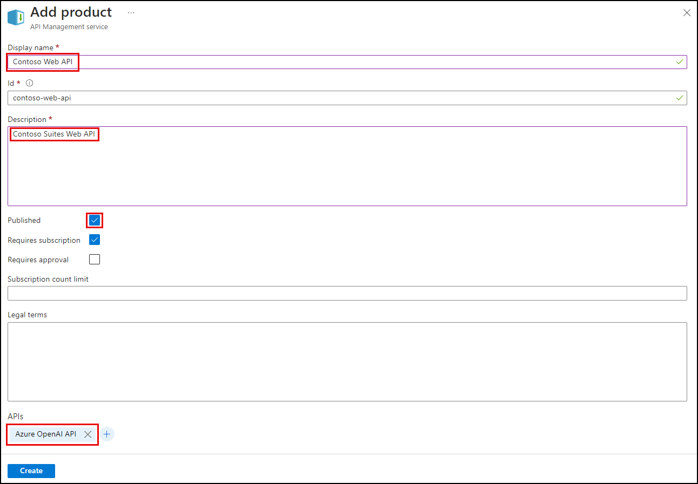
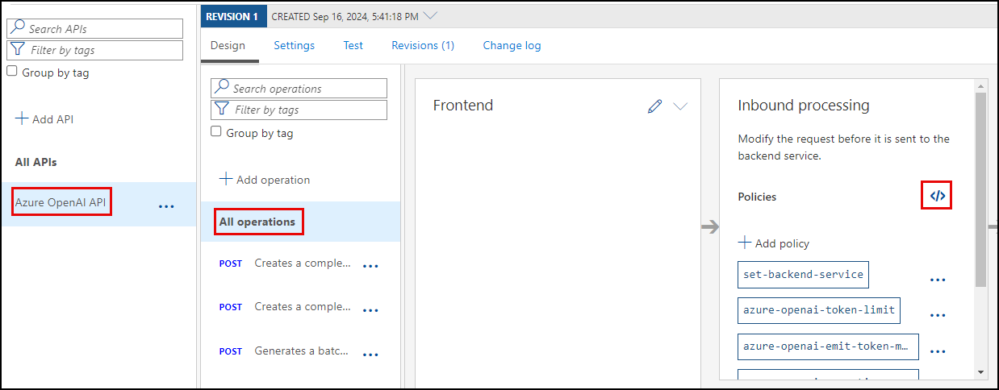
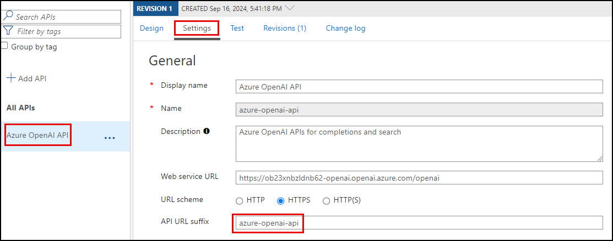

# Task 02 - Integrate APIs managed by API Management into GenAI applications (25 minutes)

## Introduction

In the rapidly evolving landscape of artificial intelligence, integrating APIs into generative AI (GenAI) applications has become a crucial step for developers seeking to enhance functionality and streamline processes. Azure API Management (APIM) provides a robust framework for managing, securing, and optimizing APIs, making it an ideal choice for integrating diverse APIs into GenAI applications.

## Description

The previous exercises sent all calls to perform text embedding and chat completions directly to your Azure OpenAI service's API endpoint. In this task, you will integrate the Azure OpenAI API managed by API Management into the Contoso Suites Web API, sending chat completion and embedding requests through APIM and enabling the GenAI gateway capabilities and policies you enabled in the previous task to be applied.

## Success Criteria

- You have created a product named "Contoso Web API" in APIM that requires a subscription and has been added to the Azure OpenAI API.
- You have updated the token limit policy for the Azure OpenAI API in APIM to allow a TPM of 4000 and have disabled prompt token estimation.
- You have added secrets named `ApiManagement:Endpoint` and `ApiManagement:ApiKey` to the user secrets collection of the `ContosoSuitesWebAPI` project.
- You have updated the `ContosoSuitesWebAPI` project to route all chat completion and embedding calls through the Azure OpenAI API endpoint defined in APIM.
- You have successfully used the Maintenance Request Copilot on the **Copilot Chat** Streamlit page to generate a maintenance request.
- You have inspected the logs in Application Insights to view the token consumption of interactions with the copilot.
- If possible, you have completed the bonus task of provisioning a second Azure OpenAI instance and adding round-robin load balancing to your Azure OpenAI API exposed through APIM.

## Learning Resources

- [API Management Products](https://learn.microsoft.com/en-us/azure/api-management/api-management-key-concepts#products)
- [Tutorial: Create and publish a product](https://learn.microsoft.com/azure/api-management/api-management-howto-add-products?tabs=azure-portal)
- [Subscriptions in Azure API Management](https://learn.microsoft.com/azure/api-management/api-management-subscriptions)
- [Create subscriptions in Azure API Management](https://learn.microsoft.com/azure/api-management/api-management-howto-create-subscriptions)
- [Load-balanced pool in Azure API Management](https://learn.microsoft.com/azure/api-management/backends?tabs=bicep#load-balanced-pool)
- [Load balancing options](https://learn.microsoft.com/azure/api-management/backends?tabs=bicep#load-balancing-options)

## Tips

1. If you receive authentication errors for Cosmos DB when running your Web API project, it may be that internal policies have disabled key-based authentication. To fix this:

    Navigate to the `src\InfrastructureAsCode` folder to Visual Studio Code and right-click the `DeployAzureResources.bicep` file. Then, select **Deploy Bicep File...** in the context menu. This will update your Azure Cosmos DB instance to re-enable key-based authentication.

    {: .note }
    > The update may take up to 10 minutes before you see the change apply.

## Key Tasks

### 01: Publish a protected Contoso Web API product

Publish a *protected* product named "Contoso Web API" in APIM and add it to your Azure OpenAI API.

<details markdown="block">
<summary><strong>Expand this section to view the solution</strong></summary>

To create and publish a *protected* product in APIM and add it to your Azure OpenAI API:

1. Navigate to your APIM instance in the [Azure portal](https://portal.azure.com/), then select **Products** under the **APIs** menu.
2. Select **Add** to create a new product.
3. In the **Add product** dialog:
   1. Enter a display name of "Contoso Web API," which will automatically set the **Id** field to "contoso-web-api."
   2. Enter a description, such as "Contoso Suites Web API."
   3. Check the **Published** box.
   4. Ensure the **Requires subscription** box is checked. This flag specifies that the product is *protected,* meaning a subscription key will be required to access the product.
   5. Select the **+** below **APIs** at the bottom of the dialog and select the **Azure OpenAI API**. Adding an API allows it to be accessed using the subscription key associated with the Contoso Web API product.
   6. Select **Create**.

        

4. After creating the product, select it from the Products list.
5. On the **Contoso Web API** project page, select **Subscriptions** from the left-hand menu, then select **Add subscription** on the toolbar.
6. In the **New Subscription** dialog, enter "contoso-web-api" into the **Name** field, "Contoso Web API" into the **Display name** field, and then select **Create**.

</details>

### 02: Update token limiting policy

Update the token limiting policy in APIM. First, increase the TPM limit to 4000 for the Web API to allow the copilot sufficient capacity to perform its duties. Then, set `estimate-prompt-tokens` to `false`.

{: .note }
> Leaving the `estimate-prompt-tokens` flag set to `true` can result in errors where the policy cannot parse and estimate tokens for the incoming request when using a Semantic Kernel copilot agent, which may generate a chat history containing empty messages.

<details markdown="block">
<summary><strong>Expand this section to view the solution</strong></summary>

To update the token limit policy applied to the Azure OpenAI API in APIM:

1. Navigate to your API Management service's **APIs** page in the [Azure portal](https://portal.azure.com/) and select the **Azure OpenAI API**.
2. Select **All operations** in the design panel, then open the inbound processing policies by selecting the `<\>` link within that panel.

    

3. In the **Policies** XML document, locate the `azure-openai-token-limit` policy definition within the `<inbound>` processing section.
   1. Update the `tokens-per-minute` value to `4000`.
   2. Set the `estimate-prompt-tokens` property to `false`.

        {: .note }
        > Leaving this flag set to `true` can result in errors where the policy is unable to parse and estimate tokens for the incoming request when using a Semantic Kernel copilot agent, which may generate a chat history with empty messages.

4. The updated policy definition should look like the following:

    ```xml
    <azure-openai-token-limit tokens-per-minute="4000" counter-key="@(context.Request.IpAddress)" estimate-prompt-tokens="false" tokens-consumed-header-name="consumed-tokens" remaining-tokens-header-name="remaining-tokens" />
    ```

5. Select **Save**.

</details>

### 03: Add new secrets

Add new secrets named `ApiManagement:Endpoint` and `ApiManagement:ApiKey` to the `user-secrets` collection in the `ContosoSuitesWebAPI` project. The values assigned to these secrets are the Azure OpenAI API endpoint exposed by APIM and the "Contoso Web API" product subscription key, respectively.

<details markdown="block">
<summary><strong>Expand this section to view the solution</strong></summary>

To add new user secrets for the API Management endpoint and key:

1. Navigate to your APIM instance in the [Azure portal](https://portal.azure.com/).
2. On the **Overview** page, copy the **Gateway URL** from the **Essentials** panel. Save the value into a text edit, such as Notepad, for use below.
3. Select **APIs** from the **APIs** menu of your APIM instance, then select **Settings** tab of the **Azure OpenAI API**. Copy the **API URL suffix** and save it to a text editor for use below.

    

4. In Visual Studio Code, open a new terminal and change directories to the `ContosoSuitesWebAPI` folder. Then, run the following command to create a new secret in the `user-secrets` collection, replacing the `{YOUR_API_MANAGEMENT_ENDPOINT}` and `{YOUR_AZURE_OPENAI_API_URL_SUFFIX}` tokens with the gateway URL and API URL suffix values you copied above, respectively.

    ```bash
    dotnet user-secrets set "ApiManagement:Endpoint" "{YOUR_API_MANAGEMENT_ENDPOINT}/{YOUR_AZURE_OPENAI_API_URL_SUFFIX}"
    ```

5. Return to your APIM instance in the [Azure portal](https://portal.azure.com/), and select **Subscriptions** under the **APIs** menu.
6. On the **Subscriptions** page, select the ellipsis at the end of the **Contoso Web API** subscription and select **Show/hide keys** in the context menu.
7. Copy the **Primary key** value.
8. Next, you will create another secret in the `user-secrets` collection of the Web API project. Return to the terminal window in Visual Studio Code you used in the previous step and run the following command, replacing the `{YOUR_API_MANAGEMENT_SUBSCRIPTION_KEY}` with the **Primary key** value you copied above.

    ```bash
    dotnet user-secrets set "ApiManagement:ApiKey" "{YOUR_API_MANAGEMENT_SUBSCRIPTION_KEY}"
    ```

</details>

### 04: Route chat completions through APIM

Update the `ContosoSuitesWebAPI` project to route all chat completion and embedding calls through the Azure OpenAI API endpoint defined in APIM.

<details markdown="block">
<summary><strong>Expand this section to view the solution</strong></summary>

To update the Contoso Suites Web API to use the Azure OpenAI API exposed through Azure API Management, you must update the Kernel builder in the `Program.cs` file to use the APIM endpoint and key for all text embedding and chat completion calls.

1. In Visual Studio Code, navigate to the `ContosoSuitesWebAPI` folder and open the `Program.cs` file.
2. The Kernel builder defined in `Program.cs` contains calls to add chat completion and text embedding capabilities to the kernel.
3. Within the `kernelBuilder.AddAzureOpenAIChatCompletion()` function, replace the `AzureOpenAI` configuration values used for the `endpoint` and `apiKey` properties to reference `ApiManagement:Endpoint` and `ApiManagement:ApiKey`, respectively. The updated function call should look like this:

    ```csharp
    kernelBuilder.AddAzureOpenAIChatCompletion(
        deploymentName: builder.Configuration["AzureOpenAI:DeploymentName"]!,
        endpoint: builder.Configuration["ApiManagement:Endpoint"]!,
        apiKey: builder.Configuration["ApiManagement:ApiKey"]!
    );
    ```

4. In the `kernelBuilder.AddAzureOpenAITextEmbeddingGeneration()` function, update the `endpoint` and `apiKey` properties to retrieve the `ApiManagement:Endpoint` and `ApiManagement:ApiKey`, respectively. The updated function call, including the `#pragma warning` directives wrapping it, will look similar to the following:

    ```csharp
    #pragma warning disable SKEXP0010 // Type is for evaluation purposes only and is subject to change or removal in future updates. Suppress this diagnostic to proceed.
        kernelBuilder.AddAzureOpenAITextEmbeddingGeneration(
            deploymentName: builder.Configuration["AzureOpenAI:EmbeddingDeploymentName"]!,
            endpoint: builder.Configuration["ApiManagement:Endpoint"]!,
            apiKey: builder.Configuration["ApiManagement:ApiKey"]!
        );
    #pragma warning restore SKEXP0010 // Type is for evaluation purposes only and is subject to change or removal in future updates. Suppress this diagnostic to proceed.
    ```

</details>

### 05: Test chat completion

Confirm you can successfully make chat completion calls via the web API by creating a new maintenance request using the Maintenance Request Copilot on the **Streamlit Chat** Streamlit page.

<details markdown="block">
<summary><strong>Expand this section to view the solution</strong></summary>

To confirm that you can successfully make chat completion calls via the web API, use the Maintenance Request Copilot in the **Copilot Chat** Streamlit UI to create a new maintenance request.

1. Run the API locally by opening a new terminal window in Visual Studio code, navigating to the `src\ContosoSuitesWebAPI` directory, and starting the API using the following command:

    ```bash
    dotnet run
    ```

2. Open another terminal window, navigate to the `src\ContosoSuitesDashboard` directory, and run the following command to start the Streamlit dashboard:

    ```bash
    python -m streamlit run Index.py
    ```

3. Select the **Copilot Chat** page using the left-hand menu, then submit the following conversational prompts:
   1. First, send a message requesting help filing an issue, such as: "Please help me create a maintenance request for a room at the Grand Regency."
      1. You should get a response asking for more information.
   2. Next, provide details about the issue to the copilot, such as: "There is a leak coming from under the kitchen sink. The customer reported it when returning to the room after being out most of the day. The carpet in the room is soaked."
      1. You should get a reply asking for the room number.
   3. Provide a room number, such as: "It is in room 303."
      1. You should get a reply that the request was created successfully.
   4. Send a final message, asking the copilot to provide you with the ID of the maintenance request it created.

    {: .note }
    > If you receive a 429 error message at any point during the conversation, you may need to go back into the `azure-openai-token-limit` policy definition in APIM and increase the `tokens-per-minute` value.

</details>

### 06: Inspect token consumption metrics

Inspect the token consumption metrics emitted by the APIM policy in Application Insights. The existence of these metrics helps to verify that Azure OpenAI API calls are going through your APIM instance and that the policies you defined are working correctly.

<details markdown="block">
<summary><strong>Expand this section to view the solution</strong></summary>

To inspect the token consumption metrics emitted by the APIM policy in Application Insights:
  
1. From your API Management service in the [Azure portal](https://portal.azure.com/), expand the **Monitoring** menu and select **Application Insights**, then select your Application Insights instance from the list.
2. On the Application Insights page, expand the **Monitoring** menu and select **Logs**.
3. On the **Logs** page, execute the following Kusto query to look for records in the `customMetrics` table:

    ```kusto
    customMetrics
    | where timestamp > ago(1h)
    | where name in ('Completion Tokens', 'Prompt Tokens', 'Total Tokens')
    | extend
        ItemId = substring(itemId, 24),
        ApiId = tostring(customDimensions['API ID']),
        ClientIpAddress = tostring(customDimensions['Client IP address'])
    | summarize
        CompletionTokens = sumif(value, name == 'Completion Tokens'),
        PromptTokens = sumif(value, name == 'Prompt Tokens'),
        TotalTokens = sumif(value, name == 'Total Tokens')
        by ItemId, ApiId, ClientIpAddress
    ```

</details>

## Bonus Tasks (if time allows)

This bonus task allows you to explore API Management's support of backend pools when you want to implement multiple backends for an API and load-balance requests across those backends. You will implement a load-balanced pool to distribute the LLM workload across two instances of Azure OpenAI.

{: .note }
> Resource quotas may prohibit you from deploying a second instance of Azure OpenAI in the same subscription or region, so it may not be possible for everyone to complete this bonus activity.

### 01: Deploy a second Azure OpenAI instance

Deploy a second Azure OpenAI instance in a new resource group using the `DeployAzureOpenAIResource.bicep` script. It is also recommended that you select a region different from your primary resource group.

<details markdown="block">
<summary><strong>Expand this section to view the solution</strong></summary>

To deploy a second Azure OpenAI service into a new resource group using a Bicep script:
  
1. Create a new resource group in your subscription. This subscription **must** have access to Azure OpenAI, and you should deploy the resource group to a [region that supports GPT-4o](https://learn.microsoft.com/azure/ai-services/openai/concepts/models#model-summary-table-and-region-availability).

    > **Important**: You must deploy to an Azure region that supports the **GPT-4o, 2024-05-13** model. You must create your Azure OpenAI resource in one of the [supported regions](https://learn.microsoft.com/azure/ai-services/openai/concepts/models#model-summary-table-and-region-availability).

2. Right-click the `DeployAzureOpenAI.bicep` script in the `src/InfrastructureAsCode/` folder, select **Deploy Bicep File...**, and follow the prompts to provide a deployment name and select the new resource group you created above. This script has no associated parameter file, so select **None** at that prompt.

    The Bicep script will deploy an Azure OpenAI service and create deployments for the `gpt-4o` and `text-embedding-ada-002` models within that instance that match what is in the primary service instance. The models deployed between load-balanced services must have the same name and version.

</details>

### 02: Import the new service resource

Import the new Azure OpenAI service resource as an API in Azure API Management.

<details markdown="block">
<summary><strong>Expand this section to view the solution</strong></summary>

To import the new Azure OpenAI service resource as an API in APIM, follow the same steps you used when importing your primary Azure OpenAI service in Exercise 6 Task 1, but provide a different name to the API, such as "Secondary Azure OpenAI API."

1. Add the "Contoso Web API" product to the API, allowing it to be accessible using the same subscription key.
2. When configuring the token consumption management policy, assign a TPM value of "4000" or higher if you adjusted that during the Maintenance Request Copilot testing.

</details>

### 03: Configure a load balancing policy

Configure a round-robin load balancing policy to swap requests between the backends.

<details markdown="block">
<summary><strong>Expand this section to view the solution</strong></summary>

To create a backend load balancing pool:

1. Open the **Azure OpenAI API** design window, select **All operations**, then open the Inbound policies XML document.
2. At the top of the `<inbound>` processing section, insert the following variable declarations and policy snippets:

    ```xml
    <!-- Create a backend counter variable that is persistent in the local cache between requests -->
    <cache-lookup-value key="backend-counter" variable-name="backend-counter" />
    <choose>
        <when condition="@(!context.Variables.ContainsKey("backend-counter"))">
            <set-variable name="backend-counter" value="0" />
            <cache-store-value key="backend-counter" value="0" duration="100" />
        </when>
    </choose>
    <!-- Choose the backend service based on the backend variable -->
    <choose>
        <when condition="@(context.Variables.GetValueOrDefault<string>("backend-counter") == "0")">
            <set-backend-service id="primary-backend" backend-id="azure-openai-api-openai-endpoint" />
            <set-variable name="backend-counter" value="1" />
            <cache-store-value key="backend-counter" value="1" duration="100" />
        </when>
        <otherwise>
            <set-backend-service id="secondary-backend" backend-id="secondary-azure-openai-api-openai-endpoint" />
            <set-variable name="backend-counter" value="0" />
            <cache-store-value key="backend-counter" value="0" duration="100" />
        </otherwise>
    </choose>
    ```

3. Select **Save**.

</details>

### 04: Test the policy

Test the policy using the **Test** tab for the **Creates a completion for the chat message** API endpoint. Use the **Trace** button to send the request and inspect the `set-backend-service` block within the Inbound section and the `set-backend-service` block within the Backend section to determine which backend was used.

<details markdown="block">
<summary><strong>Expand this section to view the solution</strong></summary>

To test the API, select **Azure OpenAI API** from the list of APIs on your API Management service's APIs page.

1. Select the **Test** tab, then select the **Creates a completion for the chat message** endpoint.
2. On the **Creates a completion for the chat message** page, enter the following under **Template parameters**:
   1. **deployment-id**: Enter "gpt-4o"
   2. **api-version**: Enter "2024-06-01"
3. Scroll down to the **Request body** section, ensure **Raw** is selected, and paste the following into the text box.

    ```json
    {
        "messages":[
            {"role": "system", "content": "You are a sarcastic unhelpful assistant."},
            {"role": "user", "content": "Tell me a story about AI."}
        ]
    }
    ```

4. Select **Trace** at the bottom of the page.
5. Scroll to the page's **HTTP response** section.
6. Select the **Trace** tab.
7. Use the **Backend** link to jump to the backend section of the trace output and locate the `set-backend-service` block. Within this block, note the `oldBackendServiceUrl` and the `newBackendServiceUrl` values. If they are the same, the primary instance was used. If they differ, the secondary Azure OpenAI instance was used.

    After the first request, the value looks like this, where the old and new backend services URLs are the same:

    ```json
    {
        "message": "Backend service URL was changed.",
        "oldBackendServiceUrl": "https://ob23xnbzldnb62-openai.openai.azure.com/openai",
        "newBackendServiceUrl": "https://ob23xnbzldnb62-openai.openai.azure.com/openai",
        "request": {
            "url": "https://ob23xnbzldnb62-openai.openai.azure.com/openai/deployments/gpt-4o/chat/completions?api-version=2024-06-01"
        }
    }
    ```

    After the second request, the `newBackendServiceUrl` value has changed to the secondary Azure OpenAI instance:

    ```json
    {
    "message": "Backend service URL was changed.",
        "oldBackendServiceUrl": "https://ob23xnbzldnb62-openai.openai.azure.com/openai",
        "newBackendServiceUrl": "https://hqfycfwt6hjh4-openai.openai.azure.com/openai",
        "request": {
            "url": "https://hqfycfwt6hjh4-openai.openai.azure.com/openai/deployments/gpt-4o/chat/completions?api-version=2024-06-01"
        }
    }
    ```

    Each subsequent request will round-robin requests back and forth between the two instances.

Because the Contoso Suites Web API is already configured to send requests through APIM, the application does not need additional configuration changes to take advantage of load balancing across multiple Azure OpenAI instances.

</details>
