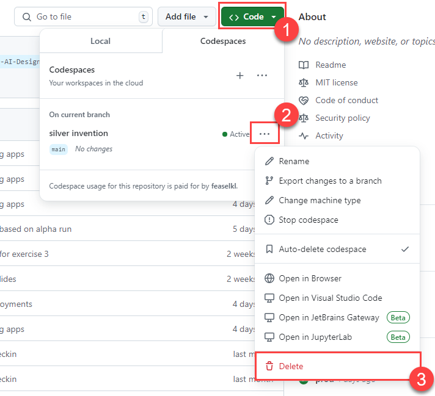
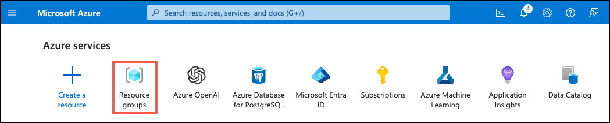

# Task 01: Delete Azure resources and GitHub codespaces

Once you have completed the exercises in this workshop, delete the Azure resources and GitHub codespaces you created. You are charged for the configured capacity in Azure, so removing all resources ensures you do not incur charges for undeleted workshop resources.

In this task, you will delete the GitHub codespace and Azure resources you created for this workshop.

## GitHub Codespaces Cleanup

To delete your GitHub codespaces instance:

1. Navigate to your forked GitHub repository.
2. Select the **Code** button.
3. Select the ellipsis (`...`) button next to your active Codespace.
4. Choose the **Delete** option.
5. In the modal confirmation dialog, select **Delete** to confirm that you wish to delete the Codespace.

    

## Delete Azure resources

Follow these instructions to delete your Azure resource group and all resources you created for this lab.

1. Navigate to the [Azure portal](https://portal.azure.com/), and on the home page, select **Resource groups** under Azure services.

      

2. In the filter for any field search box, enter the name of the resource group you created for this lab, and then select your resource group from the list.

3. On the **Overview** page of your resource group, select **Delete resource group**.

    

4. In the confirmation dialog, enter the resource group name you are deleting to confirm and then select **Delete**.

5. If you completed the bonus task in Exercise 6, repeat the above steps to delete the resource group you created to host your secondary Azure OpenAI service.
